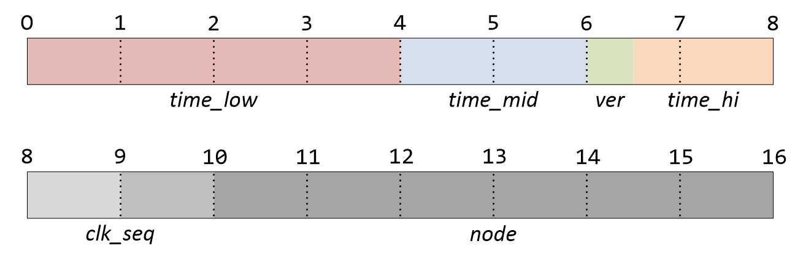

I spent some time researching my needs for primary keys in a new system I'm building and storing in Snowflake.

YMMV, but I needed an "ordered UUID." UUIDs would be generated on many distributed clients and need to be stored in a performant, cost-effective fashion.

For another introduction to this topic, see: [The Wild World of Unique Identifiers (UUID, ULID, etc)](https://medium.com/geekculture/the-wild-world-of-unique-identifiers-uuid-ulid-etc-17cfb2a38fce)

## My ordered UUID roundup

For the sake of simplicity, I'll refer to all UUIDs that can be lexicographically sorted (LS) or that are monotonically increasing (MI) as ordered UUIDs.

All ordered UUIDs below feature the pros of any ordered UUID: 

- Sortable to a pretty good degree of accuracy.
- Efficient for database querying.
- Good for distributed architecture.
- Unique. ([No accidentally deleting one resource when you meant another.](https://news.ycombinator.com/item?id=31220846) A problem with non-universally-unique IDs.)
- As collision-safe as possible.

The notes I list will below be unique to each solution. And I will be referencing the JavaScript libraries of each.

These were my top picks:

### [ULID](https://github.com/ulid/javascript)

Lots of weekly downloads. But current build errors, open issues, and unmerged pull requests. Appears to be no longer maintained and have some compatibility issues.

Debate if 80 bits of randomness is enough.

Douglass Crockford's BASE32 seems cool. But really, the implementation is... stupid. (Let's not include the letter `u` in the off-chance that it occurs after an `f` so that we don't accidentally say "FU" when reading the id aloud...) Often touted as a benefit of ULID, this is neither a win nor a loss in my book. ULIDs are just as difficult to read as any other ID.

Relies on a `crypto` random number generator, so won't work on browsers without them. I.e. no `Math.random()` fallback. We have to polyfill on our own.

_My take: `crypto` isn't necessary for IDs. They aren't guaranteed to be secure. We just need "random enough" noise. We should prefer `crypto`, but falling back to `Math.random()`—if there's nothing else and we need client-side ID generation—is totally acceptable._

### [ULIDX](https://github.com/perry-mitchell/ulidx)

A fork of ULID (above) that attempts to address the compatibility issues that ULID (above) has as well as keep the library maintained.

Still at version 0.30.0. Low weekly downloads, but climbing?

### [KSUID](https://github.com/segmentio/ksuid)

Segment's battle-tested ordered UUID solution. They did the research ([A brief history of the UUID](https://segment.com/blog/a-brief-history-of-the-uuid/)) and came up with this for their analytics platform.

It has the most random noise, 128 bits.

But it's a per-second implementation as opposed to per millisecond. I agree that per-millisecond is probably unnecessary giving machine-clock-syncing issues. But 1-second seems too much. (Though the extra randomness helps. And they're experts, so I'm sure it's fine.) Something like [Sonyflake](https://github.com/sony/sonyflake)'s 10-millisecond buckets seems just right.

An interesting discussion on [ksuid vs ulid](https://news.ycombinator.com/item?id=24657602) on Hacker News.

The [most popular JavaScript implementation](https://www.npmjs.com/package/ksuid) is for Node only. There is a browser implementation ([xksuid](https://npm.io/package/xksuid)) but has 0 weekly downloads and is on version 0.0.2.

### [CUID](https://github.com/ericelliott/cuid)

Has it all?

- Timestamp (to the millisecond)
- Process counter
- Machine/browser fingerprint
- Random noise (`crypto` where available, `Math.random()` where not)
- Bonus: starts with a letter (`c`) to make them usable as `id`s of HTML entities.

If I were rolling my own, this is how I'd build out the ID.

The only downside: the length of the CUID is not guaranteed. Folks are seeing 25-character and 26-character CUIDs now. [The creator says](https://github.com/ericelliott/cuid/issues/51) they can vary from 25 character to 29 characters by his best guess. The Prisma ORM [recommends VARCHAR(30) to be safe](https://www.prisma.io/docs/reference/api-reference/prisma-schema-reference#remarks-20).

And for the record, CUID's `slug` method [also doesn't have a guaranteed length](https://github.com/ericelliott/cuid/issues/16).

If I were implementing a CUID in a SQL database where performance was more important than storage, I would add a function to the end of my CUID generation that padded zeroes between the `c` and the timestamp so the length would always be 30. Then you could use CHAR(30) or BINARY(30) as the data type. (But see my Snowflake notes below.)

Finally, CUIDs are [very popular](https://www.npmjs.com/package/cuid) and have been battle tested thoroughly.

### Should you roll your own ordered UUID?

As I said, I was close to remaking CUID before I discovered it.

Though I was planning to shorten the machine/client fingerprint significantly by using a [Pearson Hash](https://en.wikipedia.org/wiki/Pearson_hashing). I don't know if this is the best idea, but because I planned on having few machines it seemed to make sense to save the bits. A [good breakdown of Pearson Hashing](https://www.gkbrk.com/wiki/pearson-hashing/). A [JavaScript function](https://gist.github.com/thejsj/481602b414c2f8defd03d41a23c255d8). A [Node package](https://github.com/abenmrad/node-pearson-hash).

### Can you rearrange v1 UUID to make it an ordered UUID?

v1 UUIDs utilize a timestamp and machine ID. You could roll your own ordered UUID by [rearranging the parts of a v1 UUID](https://stackoverflow.com/a/62639256/6305196). The UUID would no longer be "universally unique" or conform to RFC4122 spec, but it would be unique in your system.

To do so, change this structure:

To:

`ver-hi-mid-low-clk-node`

UUIDv1 has random bits in there too because it measures time low in nanoseconds which some machines cannot do and they simply fill it with random bits.

UUIDv1 is very unique, but not so anonymous. Like a CUID, you can decode it to get the timestamp and machine id. But... if you rearrange it (in effect, rolling your own), attackers won't immediately know they are looking at a standard UUIDv1 that they can exploit (if you use it in purposes that are intended to be more secure).

A rearranged UUIDv1 is tempting to me, but why not just use a CUID? A CUID is a little smaller in size. A CUID has also been battle-tested. And rearranging a UUIDv1 into something of your own creation is more prone to a bug you've introduced. Your own solution can only be battle tested by you.

## How to store a UUID as a primary key

Here's how you should store an ordered UUID in your database platform of choice. Try the first option, then work down.

1. First, does your database support UUID data types? Use that.
2. Next best is BINARY(n) where `n` is the length of 8-bit bytes you need. (Note: `n` will also be the amount of characters in the string generated by your UUID library.)
3. VARBINARY(n) where `n` is the max bytes your ordered UUID could be.
4. CHAR(n) where `n` is the exact length you need.
5. VARCHAR(n) where `n` is the max length you'll need.

When you store as a UUID data type or BINARY or VARBINARY data type, you'll need to perform ["a few extra tiny incantations"](https://rbranson.medium.com/why-you-should-avoid-uuids-f3e2936d6ed3) to work with it in your queries. In Snowflake, you'll need to convert it [to and from HEX](https://docs.snowflake.com/en/user-guide/binary-input-output.html#hexadecimal-hex-format-example). In other SQL databases, [you'll need to do similar](https://stackoverflow.com/a/28252188/6305196).

Is all this hexing and unhexing worth it? Yeah. Even with the extra transformation, both [data storage](https://emmer.dev/blog/making-uuids-more-performant-in-mysql/) and [query speed](https://www.singlestore.com/forum/t/best-uuid-data-type/182/13) improve significantly. Note, that this is a general rule. Your database engine of choice affects it. But when it doubt, expect similar results to what others have gotten. The principles remain the same.

## How to store an ordered UUID as a primary key in Snowflake

Snowflake effectively does not have VARBINARY or CHAR types. Or rather, BINARY and VARBINARY are synonymous. And CHAR and VARCHAR are (mostly) synonymous. [Reference](https://docs.snowflake.com/en/sql-reference/data-types-text.html).

Also, there is no performance difference between using VARCHAR (1) and VARCHAR(16777216). And a 1-character string in a VARCHAR(16777216) column only consumes a single character of storage!

So, in Snowflake, the only reason you need to list the characters or bytes `(n)` you need in CHAR, VARCHAR, BINARY, or VARBINARY types is to restrict the amount of data that can be entered in. It will never affect space or performance!

So your best options for storage of ordered UUIDs in Snowflake looks like:

1. BINARY(n) where `n` is the max bytes you foresee needing.
2. VARCHAR(n) where `n` is the max characters you foresee needing.

## Using with Deno

Finally, some of my servers that will be creating and inserting ordered UUIDs will be Deno servers.

ULID, ULIDX, KSUID, CUID, and UUIDv1 all have Node packages. What about Deno?

Well, I'm only considering CUID and UUIDv1 (but rearranged).

CUID looks like it was [forked and ported over](https://deno.land/x/cuid@v1.0.0).

UUIDv1 is part of [Deno's std library](https://deno.land/std@0.139.0/uuid).

For my needs, I'm choosing the battle-tested and feature-complete CUID.