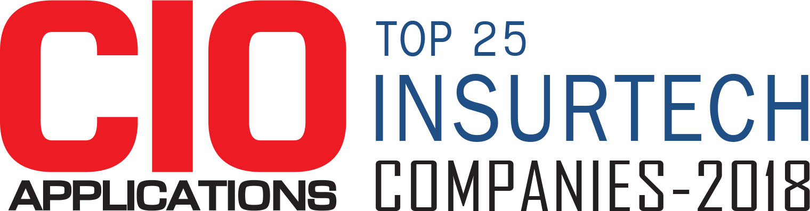
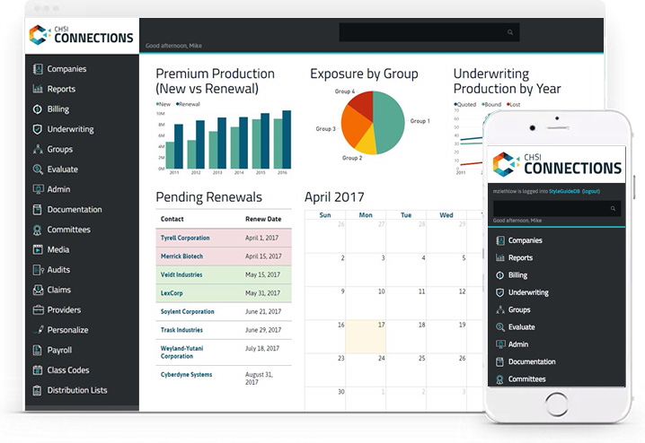

*Originally published in the [April 2018 issue of CIO Applications](https://www.cioapplications.com/magazines/April2018/InsurTech/#page=24). Also available [on the web](https://www.cioapplications.com/vendor/chsi-technologies-designing-software-for-the-next-generation-of-insurance-professionals-cid-1720-mid-96.html).*

According to a recent report from the U.S. Bureau of Labor Statistics, approximately 400,000 employees are going to retire from the insurance space in the next few years—creating a shortage of talent. This shortage is expected to be filled by millennials, but many are turned off by the industry.

It’s creating a significant talent gap within insurance companies. “The tools of the trade and the way business has been done for decades doesn’t appeal to the new generation of professionals,” says Mike Ziethlow, UX Architect at CHSI Technologies. His understanding is that millennials don’t want to invest their careers in learning dated tools or methodology. He believes that modern insuretech solutions like CHSI’s [Connections®](https://chsiconnections.com/) can bridge the gap between incoming and retiring professionals.

The next generation of insurance professionals has high demands for technology—like more intuitive interfaces and business rules guided by machine learning. Incoming tech-savvy talent knows how smart software can be and expects tech solutions that give them the right answers when they need it.

>“They ask, ‘why can’t it just work?’ or ‘why can’t it be as easy as my phone?’ because their generation is used to these kinds of intuitive applications.”

“Well-designed technology can bring new talent up to speed quickly,” says Ziethlow. “Junior talent must be able to come in and fill in the talent loss from retirees.”

But it’s not just about getting them up to speed. Ziethlow says the goal is to give insurance industry professionals the ability to ramp up even further and use technology to extend the capabilities of their business.

“It’s not about replacing jobs with technology, but rather, allowing workers to take on more advanced roles with technology assisting them.” Ziethlow sees a future in which knowledge workers move from data entry and manipulation to analysis and prediction. And he sees well-designed software as the vehicle for this move.

There’s a prevalent belief that much of the work of the insurance industry requires human analysis. “Automation cannot replace the qualitative judgment that is necessary for effective underwriting,” states a 2016 PricewaterhouseCoopers report. This is why CHSI Technologies has designed its [Connections®](https://chsiconnections.com/) product to assist insurance professionals rather than replace them.

<figcaption>

CHSI Technologies’ award-winning insuretech product Connections® incorporates CRM, underwriting, billing, claims management, analytics, and broker and policyholder portals into a single platform.

</figcaption>

For CHSI Technologies, 2018 is going to be about user experience. “Our goal will be to help our partners best manage their data and empower an incoming tech-savvy workforce to do more,” states Ziethlow. 

Utilizing software that appeals to incoming talent has another benefit to insurers—a way to jump ahead of their competitors.

Many analysts believe there will be heavy competition for the best and brightest young minds in the insurance industry. A robust, intuitive, and modern toolset like [Connections®](https://chsiconnections.com/) will be critical in capturing that talent. “The companies that adjust quickest to the technology expectations of the new workforce will find themselves way out in front of the competition,” states Ziethlow. “Not only will they have the strongest toolset, but they’ll have the best and brightest on their side as well.”

