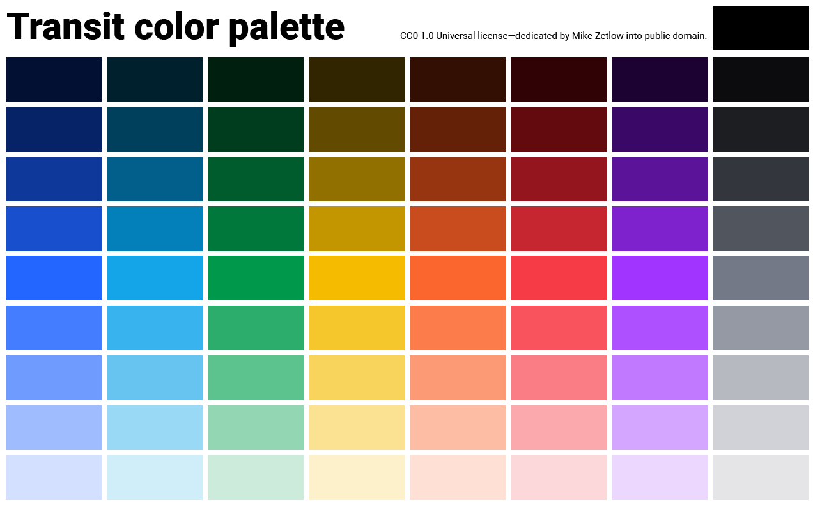
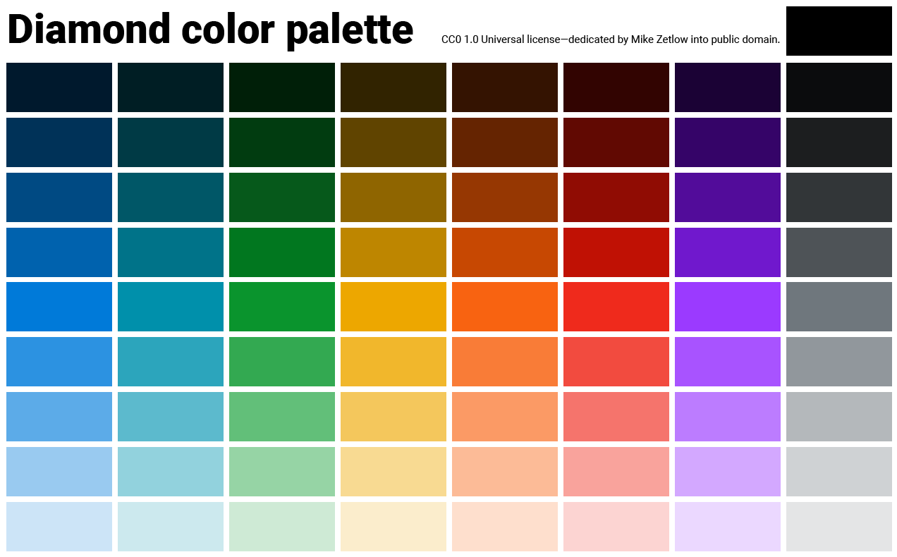
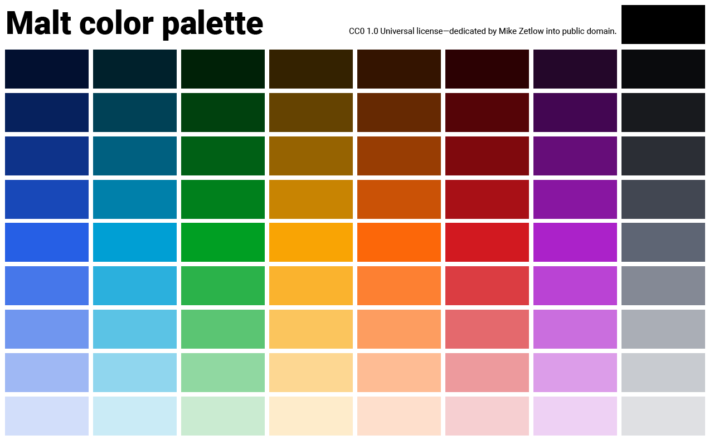

<iframe width="720" height="405" src="https://www.youtube.com/embed/M57c0kP4Jo4?rel=0" frameborder="0" allow="autoplay; encrypted-media" allowfullscreen></iframe>

In [The magical Christmas colors every app needs](/the-magical-christmas-colors-every-app-needs/) I explained the need for green and red in your application.

You'll also have to reconcile any brand colors you have.

And to look professional, you'll want to have 9 shades of each color for use in the design.

This means you need to build a cohesive palette.

I give a full tutorial above. But if you're just looking for some great palettes for your app, I've built out 3 below and released them into the public domain. Click on the images to see them in full resolution.

**Transit** was my first palette designed with the method I describe in the video. It features a bold blue and red and a bright yellow. I was focused on pleasing colors over balance, so some hues stand out more than others.

**Diamond** is the palette I design in the video. Here, every 500-shade is between 2.0 and 5.0 [contrast ratio](https://webaim.org/resources/contrastchecker/). It's a nice, even palette.

**Malt** is the final palette I made. I went with a balance of even contrast ratios and hues I liked. The grey is a little darker because the app I designed it for has a dark grey theme.

##It's a science and an art

In the end, you will make changes to your palette as the app grows in development. With the method outlined in the video above you can add hues or shades as needed and they should fit in nicely with the palette you have.

It's ok if it's not mathematically precise. Human eyes aren't mathematically precise.

Finally, be sure to check your colors on calibrated screens across all sorts of devices. Different devices render color differently.

And if this all seems like too much work (it probably is), I'll gladly make your palette for $65. Email me at mike@mikezetlow.com