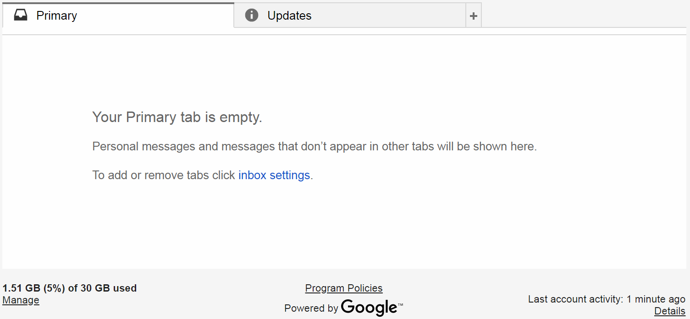
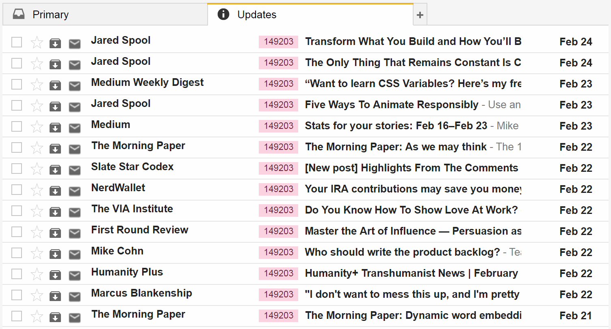
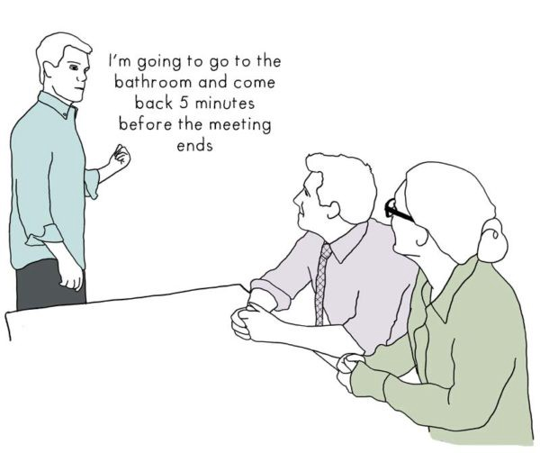
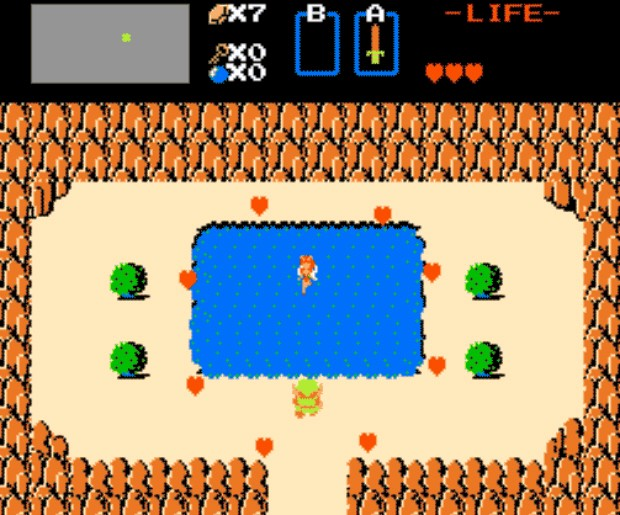
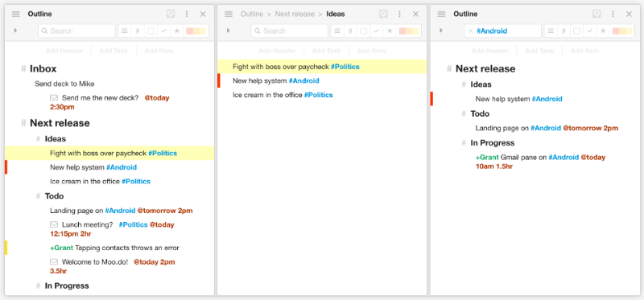
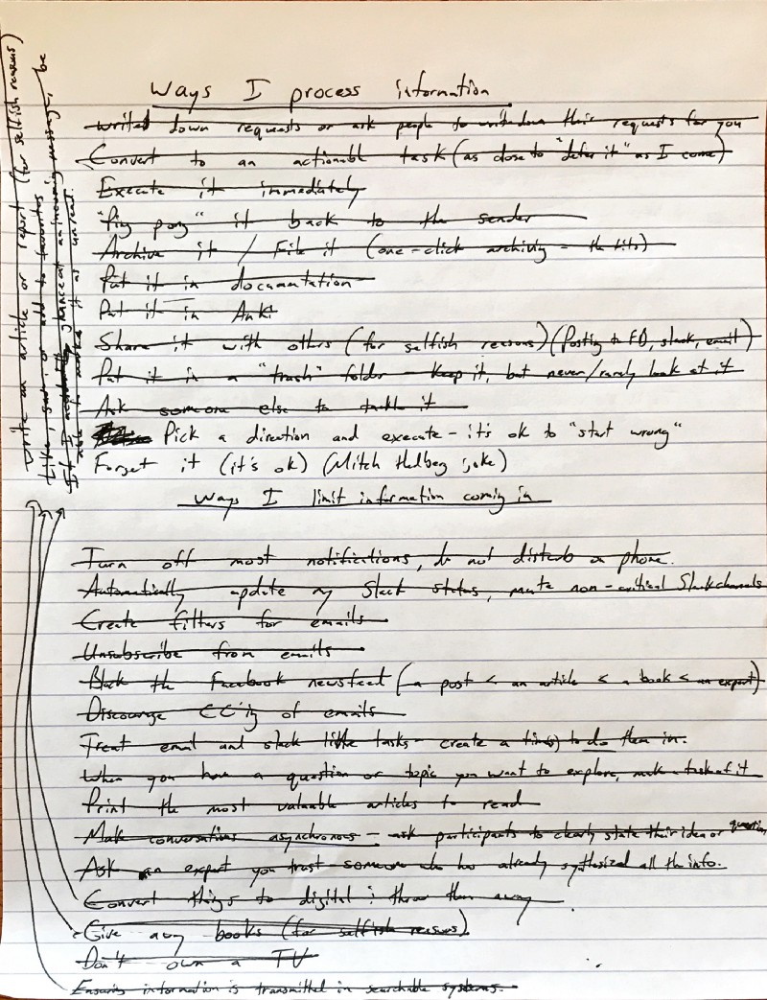

*This article was originally published on [thinkgrowth.org](https://thinkgrowth.org/how-to-handle-all-the-information-life-throws-at-you-7e5440d58498).*

Most people in the Information Age don’t handle incoming information well.

I didn’t for years: emails never opened, voicemails never returned, stuff in piles everywhere.

And to be honest, that’s a strategy that can even be considered workable — you tend to deal with whatever’s pressing, and let everything else go to heck in the background. But it’s a strategy with limits. You may get by, but you never get ahead.

I made the conscious decision to handle incoming information better when I wanted to get ahead. I was running my own business, had thousands of people involved, and so many moving pieces I was at risk of mishandling it all.

I’m not going to talk much about *why* you should manage information better; there are many fine scientific articles out there already making that case. But here are a few striking points from [Information Overload Is Crushing You](https://www.workzone.com/blog/information-overload/):

- In multiple studies, around two thirds of managers surveyed felt information overload has had a negative impact on their professional and personal relationships as well as their mental and physical health.

- Every two days we create as much information as from the dawn of civilization up until 2003.

- By 2020, 1.7 megabytes of new information will be created every second, for every human being on the earth. (This is around 3 novels worth of text. Per second. Per person. Fancy reading a quarter of a million novels a day?)

### So what do you do?

Just like one of the ways to increase profits is to reduce costs, one of the ways to get a handle on information is to **reduce the amount coming in**. You may have to be incredibly proactive, like [the guy who created an information Blockade](https://www.nytimes.com/2018/03/10/style/the-man-who-knew-too-little.html).

Secondly, you can build methods to **process the information** that does make its way to you, and habits to regularly execute those methods.

Everything I list below has been said by smart people. Below is my synthesis of what they’ve said and what is presently working for me.

## Reduce the amount of information coming in

1. **Turn off most notifications on your phone and computer.** I put my phone on do not disturb permanently. You can set it to allow Contacts or Favorites through. Or you can tell your close friends to call twice within 3 minutes to reach you in an emergency. Respect people’s time and schedule a phone call in the rare occurrence you must make one.

2. **Move 99% of your conversations to [asynchronous channels](https://medium.freecodecamp.org/live-asynchronously-c8e7172fe7ea)** (email, Facebook Messenger, Slack) so you can deal with them when appropriate.

    When having conversations in asynchronous channels, encourage the other person to clearly state their idea or question. If someone is rambling or unclear I ask something direct like, “What can I do to help you move forward on this?”

3. **In return, [be concise](http://www.hemingwayapp.com/).**

4. **Treat Slack like email, not a direct line into your soul.** Again, turn off notifications and schedule times to check it. If something is truly critical, you can have Slack notify you when someone uses a keyword like, “everythingisonfire.” (Though I’m less impressed by organizations that need their people to address emergencies frequently. There is likely a more systematic problem from the top in these organizations, and a valid strategy to manage this problem for yourself is to simply leave them.)

<figcaption>

For Slack powerusers.

</figcaption>

5. **Treat your incoming messages like any other task** — create a specific time to address them. Instant messaging is out if you want to get a handle on information overload. (Unless, of course, like phone calls, you arrange for a time to have a conversation via instant messaging.)
   
6. **Automate your Slack status** with Zapier and Google Calendar so people can see your availability and respect it, and mute non-critical channels entirely. (I’d recommend leaving some channels outright, but Slack allows team members to add you to channels, so it ends up being a tug-of-war you will always lose — ultimately I just mute the channel, but listen for critical keywords.)

7. **Regarding email, practice [inbox zero](http://www.43folders.com/izero).** The easiest way to start is to set aside time to tackle any pressing emails or convert them to tasks to deal with later. Then “select all” and archive. (I’ll go over how to process new emails in the next section.) This is a quick fresh start — everything is still available in the archive, but you have focus and clarity going forward. [Don’t use your email as a todo list](https://hbr.org/2014/03/stop-using-your-inbox-as-a-to-do-list); from now on, move actions required of you into a todo list.

<figcaption>

Here’s what my inbox looks like.

</figcaption>

8. **Unsubscribe from emails aggressively.** Look for the little often-light-grey text at the bottom of the email. Click it. Feel the relief. (You can use a tool like [Unroll.Me](https://unroll.me/) if you have an excessive amount of subscriptions.)
   
    There may be emails that you DO want to subscribe to with relevant content. Create an email filter for these and put them into their own folder, skipping the inbox. I stringently curate good email subscriptions, let them go to their own folder, and then when I have a moment and would like to read new content, I go to that folder. I ignore it until I’m ready for it, turning “push” content into “pull” content.
   

<figcaption>

Here’s what my filtered email subscriptions folder looks like.

</figcaption>

9. **In a similar vein, eradicate the Facebook news feed** with [News Feed Eradicator](https://chrome.google.com/webstore/detail/news-feed-eradicator-for/fjcldmjmjhkklehbacihaiopjklihlgg?hl=en). You’ll still be allowed to post your own status updates and reply when people mention your name. You can also set up notifications if someone posts in a group or on a page you’d like to follow (if you can’t get completely off the Facebook crack).

    If you have a mobile news feed problem and don’t want to uninstall the app, you can [manually unfollow everyone](https://medium.com/@jakechristie/what-happens-when-you-unfollow-everybody-on-facebook-e3738c902d02) (killing the feed) or [be a computer nerd about it](https://www.quora.com/How-do-I-unfollow-everyone-on-Facebook-at-once) with a little coding.
   
    Content pushed on you is the Information Overload enemy advancing. Push back!
   

<figcaption>

[News Feed Eradicator](https://chrome.google.com/webstore/detail/news-feed-eradicator-for/fjcldmjmjhkklehbacihaiopjklihlgg?hl=en) removes the news feed and gives you an inspirational quote.

</figcaption>

10. **Don’t watch TV.** Same reasons — push content is the enemy.

11. **Avoid internet rabbit holes.** There’s so much interesting stuff to look up on the internet! I’ve found the solution for me is to make a research task if I’m curious about something instead of looking it up when I’m in the middle of something else.

    Often, that research task will be deprioritized into oblivion in my task app (more on that below) and then my time and cognitive load will be spared a futile journey down the rabbit hole. If it is important, I will address it like any task in due time.

    Another protip: physically print articles you find interesting from your inbox. Take them to meetings you have to attend but won’t be very productive for you. Everyone thinks you’re a jerk if you’re on your phone during a meeting, but everyone thinks you’re a crazy hard worker if you’re looking over papers spread out in front of you.
   
12. **Also, attend fewer meetings.** This is a corporate culture thing, so you may have to try to change the corporate culture or look for a job that respects your time more. Most poorly-run meetings fall into two categories: bringing everyone up to speed on an issue (which can be done via an asynchronous channel) or building consensus on an issue in which no clear decision-maker was defined (which is organizational cancer). My boss likes small meetings with a clear decision-maker defined, and that’s great; I’m not pulled into a meeting where my input isn’t required.

<figcaption>

Credit: [The Cooper Review](https://thecooperreview.com/how-to-avoid-being-invited-to-meetings/)

</figcaption>

13. **Discourage incoming email requests that are cc-ed to a group of people.** When you get a blast that’s just info sent out to the team, address it like you would any other piece of information (discussed below). But when you get that frustrated customer or team member who sends out an email with a question or request cc-ing everyone they’ve ever met at the company, you must teach them the way. I often say, “So-and-so is the best person I know of to answer this question and you should email them directly.”

    It’s proven that when you direct a request at a singular person as opposed to a group, you are more likely to get a response. In CPR class they taught us to point to someone in a crowd and say, “YOU! Call 911!” instead of yelling out, “Someone call 911!”

14. **Finally, drink only “pure, filtered” information.** When someone rants on TV or on Facebook, you’re drinking raw info with lots of crappy parasites and dirt. When you read an online or magazine article, the information is distilled a bit, a little better for you. When you read a book that’s gone through a publisher and is widely acclaimed, you’re drinking in some pretty clean info. But when you talk to an expert who has read countless books on the subject and has determined best practices for themselves, you’re drinking from a magic fountain.

## Process the information you let in

So now how do you deal with the information that actually makes its way to you? This could include actionable items, stuff you need to remember, or just stuff you find interesting or helpful.

1. **Convert information into actionable tasks if possible.** Make a decision on what needs to be done with this particular piece of information and write up a task for it, no matter how small. (Experts say that if a task is under 2 minutes you should just do it then and there. But experts also say we’re terrible at estimating time. So I recommend putting everything — even the littlest items — on a task list.)

2. **Set aside specific time to attack tasks.** Don’t do things as they come up. Block off time and get to work, one task at a time, working from a prioritized list. [Make this time short](https://en.wikipedia.org/wiki/Pomodoro_Technique), take breaks, switch tasks frequently to stay sharp, get a good night’s sleep, and repeat.

3. **Find a project management or todo list app that works for you** and is easy to incorporate into your daily routine. I use [Moo.do](https://www.moo.do/) because the tasks can be nested hierarchically. I can have a bird’s-eye view of all my projects and also drill down to the smallest task, and I can add these small sub-tasks infinitely.

<figcaption>

Screencap from [Moo.do](https://www.moo.do/).

</figcaption>

4. **Add task requests immediately to your task list** or write them down to be consolidated to your task list at a scheduled time. Ask people to write down their requests for you. If someone asks something of me and it’s not written down immediately by me or them, it risks getting lost and not done.

5. **Use "mark as unread" if you're busy.** If someone messages me a request and I happen to glance at it while working on something else, I mark the message as “unread” and address it during the time I’ve set aside to check messages.
   
    If they text me, I sometimes ask if they can email or Slack me their request since [Messages on iPhone can’t mark messages as unread](https://forums.imore.com/ios-9/353839-mark-imessage-unread.html). It can be weird to be so oddly demanding of people — “Hey, can you email me this request instead of text?” — but if information overload is “literally killing you,” you are fighting for your life here, no holds barred.

6. **"Ping pong” email / DM requests back to people.** I try to never have the holdup be on my end. I reply quickly and concisely, whether it’s asking for more information, confirming information, or saying thank you. It’s part of inbox zero. Let someone else’s inbox be full.

<figcaption>

Credit: [Giphy](https://giphy.com/gifs/frog-ping-pong-glove-and-boots-MhHmVf60oEZQQ)

</figcaption>

7. **Archive or file information that can’t be acted upon.** I use [Actions for Gmail™](https://chrome.google.com/webstore/detail/actions-for-gmail-beta/mclmmkhldnfokbgnhoibcgblghkmncem?utm_source=chrome-app-launcher-info-dialog) to archive emails with one click.

8. **Use tools that allow you to search easily** (Gmail, Slack, Keep, etc.), so if you need to reference something you’ve archived, you still have it. Nothing is deleted, only archived, no worries.

9. **Delegate when acceptable.** (And it’s often far more acceptable than you think.) I might ask, “Hey I’ve got a lot on my plate, can you tackle this? It’s ok to say no. :)” People ask a lot of me and I ask a lot in return. To better our collective output, I expect us each to agree to do what we can.

10. **Synthesize the information into personal or team documentation** you can reference later via search. Make a habit of searching your own documentation first.

11. **Put information you must recall frequently into a [spaced repetition application](https://www.wired.com/2008/04/ff-wozniak/)** (I use [Anki](https://apps.ankiweb.net/)) and make a habit of using it regularly. Be sure to [formulate the information effectively](https://www.supermemo.com/en/articles/20rules). Or you can use good, old-fashioned homemade flash cards.

<figcaption>

An example of a cloze deletion question from my Anki deck.

</figcaption>

12. **Archive physical pieces of information as well.** File folders and Bankers Boxes are cheap. If it’s non-crucial I just put it into one big folder labelled, “Misc Info 2018” or something. This is great in that you aren’t paralyzed with what to do with a piece of information (“Will I need it in the future? Can I throw it out?”), you just archive it.

13. **Click like, clap, save, or add to favorites.** When seeking out information, I read Medium articles, I watch YouTube videos, etc. I use liking, saving, or adding to favorites, not because I’ll ever go back and re-read or re-watch the material (I won’t 99% of the time), but because I know that it will make future searching easier the 1% of the time I want to recall the information. (These sites typically allow you to see what you’ve liked, applauded, saved, or favorited.) Do I ever even need to recall that 1%? Really, no — but it puts my brain at ease to know I’ve saved the information somewhere. And clicking the button is low effort.

14. **Share information.** This is one more way to make information searchable for your own future use should you need it. Post relevant articles in your company’s Slack. Message someone an article you found interesting that they would also find interesting.
    
    Often, I won’t remember where I read a great piece of information, but I will remember that I shared it with So-And-So and then I can look up that exchange and find the information.

    Like ping-ponging emails quickly back to people, feel free to put information on someone else’s plate to get it off yours. People have different incoming information tolerances and you shouldn’t assume someone can’t handle it until they express as much. With the methods outlined here, you’ll find you’ll be able to handle more information yourself when someone pulls this move on you.

15. **Write an article or report on the information.** Every one of these points I mention here, I’ve read somewhere else. By synthesizing them into *this article you’re reading*, I’ve made the information memorable and searchable for myself first, and helpful to others second.

<figcaption>

The first draft.

</figcaption>

16. **Finally, don’t feel bad about forgetting information.** My favorite Mitch Hedberg joke goes something like this: “If I wake up in the middle of the night with an idea for a joke, I have to find a pen and paper and try to write it down. Or I can just convince myself that it’s not funny and go back to sleep.” If I admit that not every idea or thought I have is a brilliant one and must be processed information, I’m ok with just letting it go.

## Reboot

When life gives me too much information—I’ve got papers everywhere, email incoming, and work piling up—I do a 1-hour reboot. I spend a half hour just cleaning up, putting stuff into 1 big folder or box. Then I spend the next half hour pulling out items from that container and processing the information in one of the ways I list above. That’s it. And then I get to work.

Over the next couple days, I work through more of the items, processing all the information I’ve let into my life.

<figcaption>

My emergency “throw everything in it and begin to sort it out” box

</figcaption>

And that’s the real trick to information management — it’s a daily process. You have to work to build up each of these routines into a habit.

You will do well if you implement just a couple of these points, and then once established, move on to a couple more — until you feel like the amount of information you let in and process is under your control.