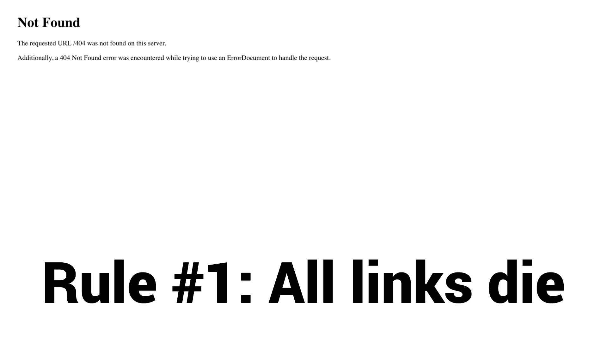
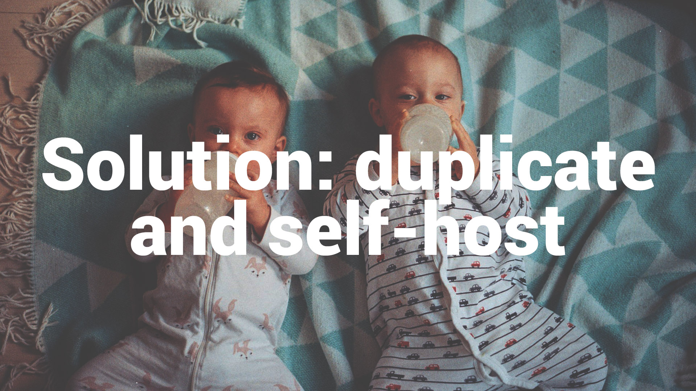
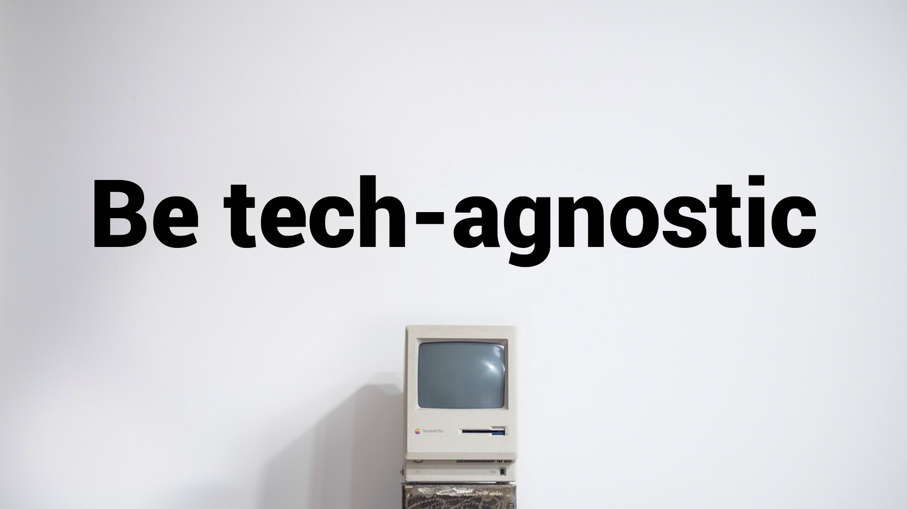
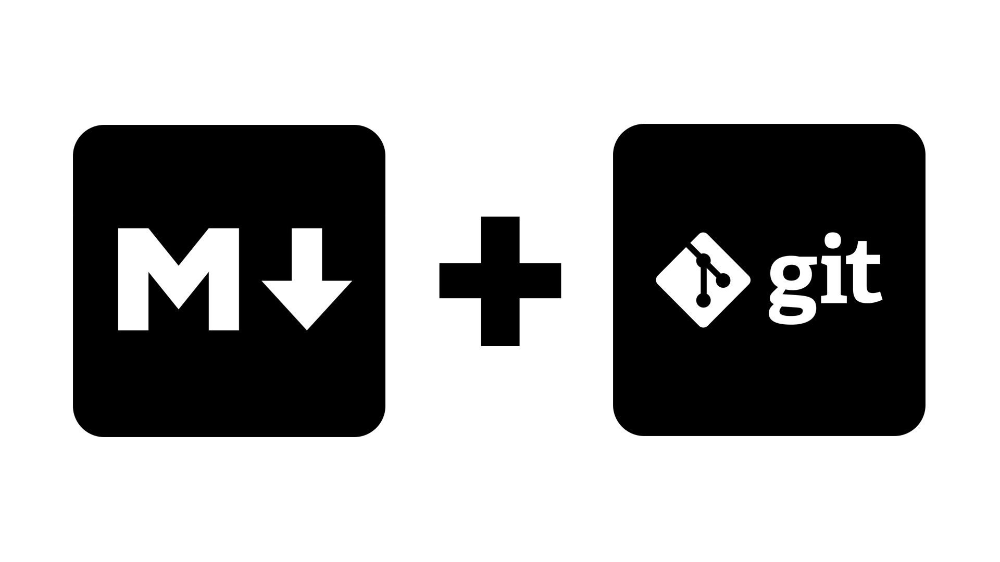
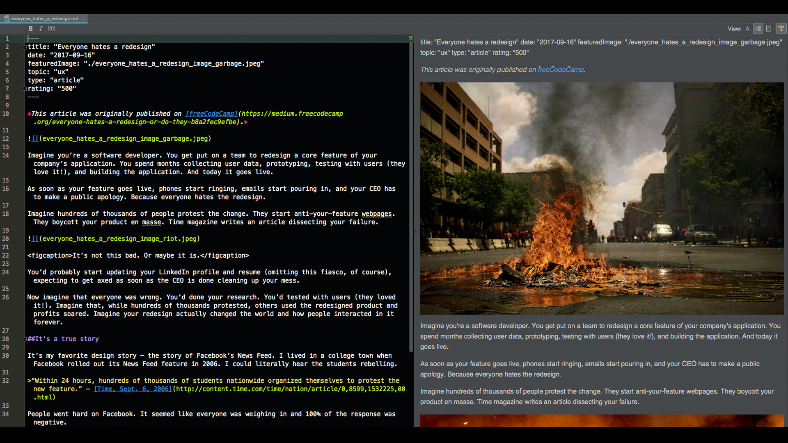
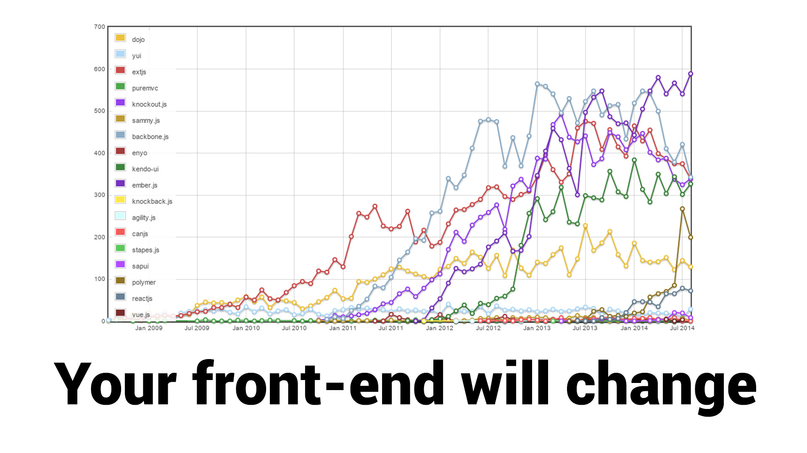

---
title: "How to live forever on the internet"
date: "2018-06-09"
featuredImage: "./1-girl-in-field-how-to-live-forever-on-the-internet-mike-zetlow.jpg"
topic: "other stuff"
type: "video"
rating: "400"
---

*This talk was given at [Demo Day Las Vegas](http://demoday.vegas/).*

<iframe width="720" height="405" src="https://www.youtube.com/embed/eTWl4nY-XJM?rel=0" frameborder="0" allow="autoplay; encrypted-media" allowfullscreen></iframe>

*Transcription from video:* Alright so my name is Mike Zetlow, and I'm going to give a presentation on how to live forever on the internet. And I don't really mean like you living forever. I mean, your work. As developers we do a lot of stuff. We code stuff online. Maybe articles get written about us. We have talks like this.

So on my portfolio page, I was linking to all this stuff that was me. I was able to direct people to my portfolio page and use it as a hub to say, hey check this out, read about me, or watch these talks, or see some of my code. But then I went out, recently I checked out my portfolio page, and there's dead links. Like the article that I was in, they changed their slug or whatever it was, or the app that I had built, that company folded.

So that's the first rule, is that all links die. You can't really rely on links on your portfolio site and that sucks, because we make stuff, a lot of us make stuff for the web. So what can we do? We can duplicate and self host.

I really mean taking the content that's there and putting it on your own portfolio site, in a way that is tech-agnostic.

If you have an article written about you, take that text, and you actually need to store it as a text file. Like I can still open a TXT file from 1995, but I can't open the same Word doc. Word has changed, it's proprietary.

Even video is kind of hard to nail down as a tech agnostic format. I recommend MP4. That's the best container right now. But you probably have to recode it or transcode it in the future to stay up-to-date. So you wanna think about how can I scrape what's out there, maybe if you have an app, take a screenshot or some video capture, and put that on your site. That's how you can show it, because code also dies. You can't give someone a snippet of FORTRAN and expect them to run it. So even the languages that we're coding now, you can't expect to live forever.

So, I recommend Markdown and Git.

I'm actually scraping stuff from like an article that's written about me, and converting it to Markdown. Markdown is a format that is text readable. You can open it as a TXT file, but it's also computer readable, and I use Git for all of my versioning of my Markdown file. So as I make changes to Markdown, Git can store all those changes.

Git is also good for pushing up and backing up to like GitLab or GitHub. You can leave comments on your changes, and you can collaborate with people. Git really facilitates Markdown. Git and Markdown is what I recommend.

This is what Markdown looks like. This is on the, my right, your left, this is all it is. It's very readable. In my editor, it actually displays on that. It kind of me gives me even more user friendly display, but this Markdown file and the images that are associated with it are all stored in their own folder.

So I've separated the content entirely from its display. If you wanna live forever, you have to do that, because your front-end will change.

I tell ya, this is only from 2009, I think to 2014. This doesn't even have... this has like React and Vue starting to bubble right here. But now that's where it is, and you see Elm and other things.

So this is just the reality of it. You're gonna wanna redo your portfolio site, so why not have it in a format that you can just, okay take the text, take all the images, take this folder, and display it however you want.

I can just add Markdown files, and just add the content, as I scrape it from the other sources, and build my own portfolio site, and that lives forever.

The only way you can live forever is to duplicate it and self host it. That's the only way that you can guarantee that stuff is out there. So, that's how you live forever on the internet.
