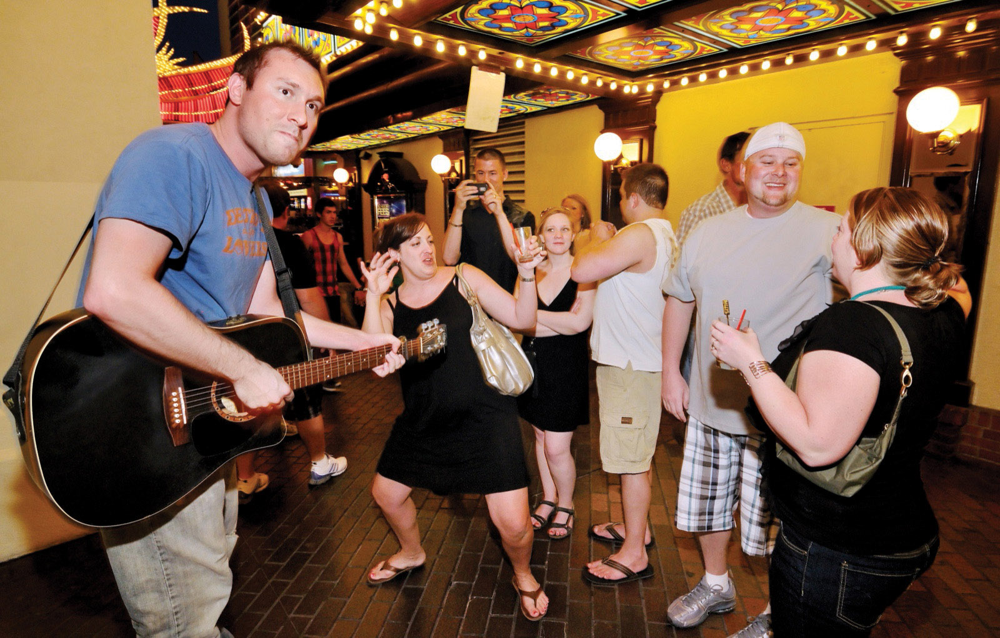
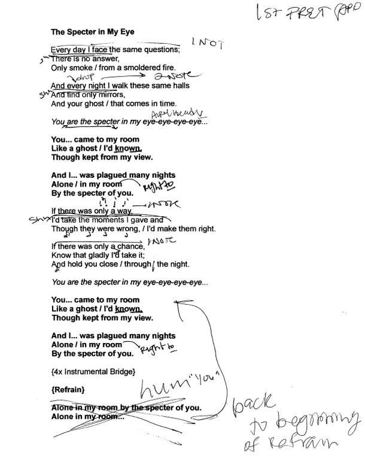
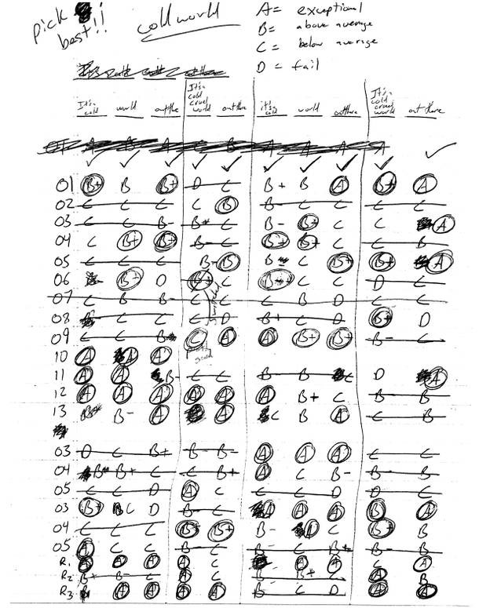

*Originally published in [Las Vegas Weekly](https://lasvegasweekly.com/as-we-see-it/2011/may/11/high-tech-savvy/). Authored by Erin Ryan.*

## Busker Mike Ziethlow bets his debut album on the power of online crowd-funding

“I’ll give you my bio after this piece of chicken,” Mike Ziethlow says. We’re sitting in a sticky pink booth in the Flamingo food court, where he’s powering up for a night of busking with cheap Chinese food and sugarless gum. There is no stage and no spotlight, no hushed audience waiting in the cool dark. There is a plastic milk crate, the unforgiving sun and thousands of people wandering the Strip looking for their next drink.

In a few minutes I will watch him transform into “The Original Acoustic Hip-Hopper,” but for now we’re talking about Ecclesiastes.

“It has metaphors that span entire paragraphs,” Ziethlow says, chow mein hanging in the air between us. “Imagery tells the story, things like ‘your days are numbered as grass that withers.’ It’s been blowing my mind.”

In addition to the Bible, Ziethlow draws inspiration from Shakespeare’s rhyme schemes and the intensity of Tom Waits and Nick Cave on the musical page. Then there’s the swagger of Martin Scorsese and Robert De Niro, ancient mythology retold by Wikipedia, David Foster Wallace’s story “Mr. Squishy,” Bjork’s album Debut, fantasy novels on tape, and his own lush dreams.

<figcaption>

Mike Ziethlow is a stickler for lyrics. Every sheet he writes is covered with scribbles only he can decipher.

</figcaption>

“I’ve conditioned myself to wake up when I have an idea. The melody just comes. The lyrics I have to sweat at,” he says. “You can see this effort upon any inspection of my first drafts: words parenthesized, crossed out, scribbled out, re-ordered, arrows detailing placement shooting across the page like a cart careening down a track only to smash into a sentence now-revised.”

Watching him do an impassioned acoustic version of Milli Vanilli’s “Girl You Know it’s True,” it’s hard to imagine how the meticulous craftsmanship connects. But busking is just a way to support his home studio, where Ziethlow is exactly 53.75 percent done making a five-song debut album for a unique musical collaboration called The Dead Languages. It can’t really be called a “band,” because the singer, Camila Ballario, and sundry supporting musicians all were hired to express Ziethlow’s vision. Each signed a four-page contract ensuring that only he would have rights to the music.

“I don’t stifle their creativity, but they understand that they’re being paid to perform my songs,” he said, explaining that a past experience working with a band taught him never to split a copyright. “With this album, it’s just my signature.”

The downside to paying musicians is that you also need resources to record and edit their work. Ziethlow makes decent money playing online poker, but his winnings are frozen due to the recent indictment of executives at the three biggest online poker sites for alleged bank fraud and money laundering. Already more than $6,000 out of pocket on the EP and hemorrhaging fast, he turned to another online gamble for help.

### All or nothing

When midnight strikes on May 16, Ziethlow will know if his dream of finishing the album has been realized or unceremoniously squashed. It will be the end of a 30-day campaign to raise $5,600 for mixing, mastering and distribution. If he’s even a penny short, the promised donations will dissolve into the ether.

There’s no mustache-twisting villain holding the cash. It’s Kickstarter, an online crowd-funding platform hailed by WIRED and the New York Times as a model for 21st century DIY. Blending social media and microfinance, it connects smalltime investors to artists working in music, film, technology, food—anything creative that needs capital to get off the ground. Backers can invest for as little as $1 and receive customized perks in return, while artists retain creative control and all proprietary rights.

But if the entire goal isn’t raised by the deadline, the promised donations are not collected. Kickstarter structures things that way so artists aren’t expected to develop projects without the necessary funds and backers aren’t harnessed to ideas that don’t manifest. Even if the goal is reached, five percent goes to Kickstarter and another five to Amazon for its payment platform. Even so, Ziethlow says he was willing to try anything to give the songs in his head a bigger life.

“Kickstarter can be a powerful tool for artists not willing to sacrifice to please the largest demographic with a dollar to spend,” he said, adding that he hopes to shop the completed EP to television networks. “Every backer is essentially saying, ‘this music— how it is—is worthy of my support.’”

For their support of $1-$1,000, backers of The Dead Languages will receive goodies ranging from downloads and CDs to personal thank you letters and autographed flotsam from the creative process.

“If they’ve been here since day one, they deserve to share in all the ideas that have been here since day one,” Ziethlow said.

### Music people love

Through [The Dead Languages Kickstarter page](https://www.kickstarter.com/projects/ziethlow/the-dead-languages-recording-a-debut-5-song-album), the 30-day marathon has taken shape as a video archive, blog, extended mission statement and real-time progress thermometer. New patrons can still sample the music there and learn the project’s history, and committed donors can enjoy footage of Ziethlow hamming it up on the Strip or losing himself in the bass licks of local musician Adam Knaff.

Ziethlow recruited Knaff at an open mic night, and being on the scene connected him to Imagine Dragons guitarist Wayne Sermon, who plays on The Dead Languages song “Who Can Command the Channels of the Heart?” Other musicians on the album were sourced at live shows and through Facebook inquiries, including Michigan-based singer Ballario.

With easy sweetness and exceptional tone, she has the “right” sound for about half of Ziethlow’s 10 songs. Despite his ability to tear it up on the milk crate and the karaoke stage, he insists he doesn’t have the right voice for his own music.

<figcaption>

Hundreds of recordings were made of singer Camila Ballario doing 10 of Ziethlow's songs. He picked the best snippets of each one to splice together on the final five-song EP, which they'll be able to finish and distribute if the Kickstarter campaign is a success.

</figcaption>

“Using film as an analogy, I’m the screenwriter and director. I’m not the star. If I have a Tom Cruise song I’m not going to cast Steve Buscemi,” he said. “I wrote 10 songs, we recorded eight seriously, and we’re going to release the best five. These songs sound good because they’re cast right. The trick is finding these people. Talented musicians are still in the 18th century.”

Lucky for them, Ziethlow is a few centuries ahead. When he goes home after a night of busking, he gets online to upload videos and manage his accounts on Facebook, Soundcloud and Myspace. With Kickstarter in the mix, he hopes to raise money for CDs, T-shirts and other promotional items that will spread the word about The Dead Languages.

Whatever happens in the last minute on May 16, Ziethlow will continue telling interesting stories about ghosts and butterflies, wounded soldiers, cold showers, burned coffee and love that keeps you up at night. At least 40 people want to listen, represented by $3,482 in Kickstarter donations (as of May 11).

“The goal is not to become rich and famous. The goal is not to make elitist, difficult art,” said Ziethlow. “The goal is to make music that people love and get it into the hands of the lovers.”