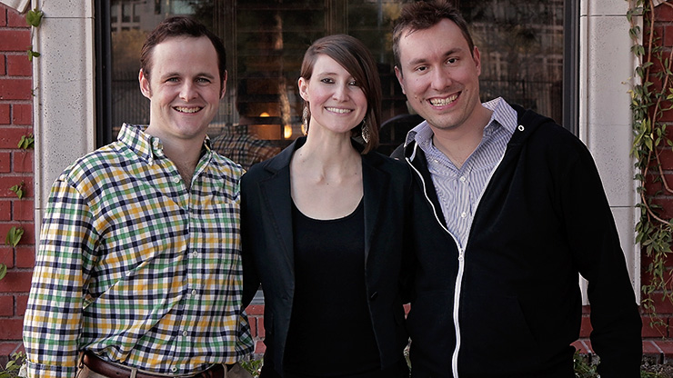
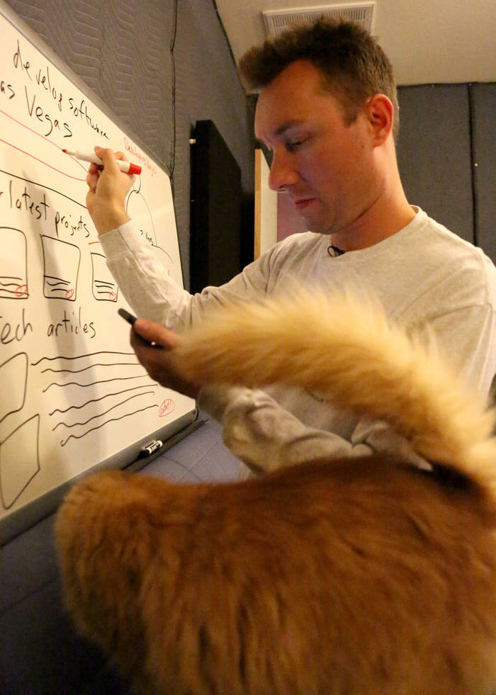
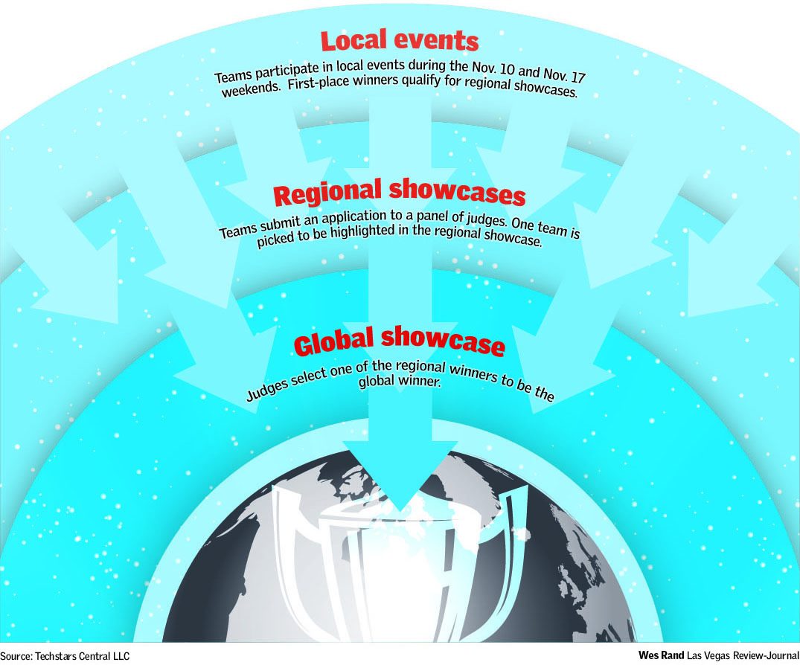

*Originally published in [Las Vegas Review-Journal](https://www.reviewjournal.com/business/entrepreneurs/new-business-ideas-expected-to-emerge-at-startup-weekend/). Authored by [Nicole Raz](https://twitter.com/JournalistNikki).*

<iframe width="720" height="405" src="https://www.youtube.com/embed/ZanbBDHXogY?rel=0" frameborder="0" allow="autoplay; encrypted-media" allowfullscreen></iframe>

 

In 2015, North Las Vegas-resident Mike Ziethlow had an idea for creating something like a Yelp for independent music artists, but he didn’t know how to turn that idea into a product.

“I didn’t know anything about anything,” he said. So, he went to Startup Weekend, a hands-on, three-day workshop designed to help launch new business ideas and startups. That year UNLV hosted the event. Nothing came of his idea that time, but he learned what he needed to do to make it work the next time around.

“I learned that I needed to learn how to code, so I taught myself how to code,” he said.

And, he learned how to make a minimum viable product.

So, he came back for another Startup Weekend later that year and won second place.

Go to busker.fm, and you’ll see his idea-turned service.

“There’s 1.3 million artists and 30 million songs in the database,” he said.

<figcaption>

Rob Mather, left, Claire Cummings and Mike Ziethlow following a Las Vegas Startup Weekend in 2015 that led to Mather and Ziethlow launching www.busker.fm.

</figcaption>

He’s going to pitch a new idea at this year’s Startup Weekend starting Friday night at the Innevation Center. He calls it [Developers.Vegas](http://developers.vegas/), which he describes as a directory of the “best software developers in Las Vegas for contract work, full-time employment, or co-founding opportunities.”

##Impressing the judges

Organizers of this year’s Startup Weekend say they are expecting more than 100 attendees.

Janet Runge, who says she has “lost count” of the number of Las Vegas Startup Weekends that she has been involved with, helped to organize or coached, says turnout usually has been between 50 and 75.

“The format is always the same. People come in on Friday evening, they pitch their ideas, teams are formed around these ideas, and then they just work like crazy over the rest of the weekend and finally pitch at the end to a group of judges,” said Runge, who is also associate director of the Center for Entrepreneurship at UNLV.

Zach Miles, who will be one of the judges, said he is looking for well-managed teams that are dedicated to moving forward.

“And, a lot of it to me is, ‘Are these particular ideas, or products, or services that they’re offering going to make some type of economic impact or diversification, especially in Nevada,’” said Miles, who is associate vice president for economic development at UNLV.

Another judge, Ciara Byrne, said she is looking for innovative and sustainable ideas.

Byrne, co-founder of Las Vegas-based Green our Planet, which runs a school gardening program, launched following a 2012 Las Vegas Startup Weekend.

“We didn’t get placed at all. We started as a crowdfunding platform, and it has since morphed into school gardening,” she said.

Startup Weekend served as “jumping off point” for her business, helping her get to “the next stage” and meet the right people.

As a judge this year, she says the sustainability of a new startup is key.

“The thing I learned is that it’s all very well to have a great, innovative idea. But, if you don’t have a plan to be sustainable, then it’s not going to work.”

##Innovative, sustainable ideas

Runge said she hopes to see a broad range of ideas this year, mirroring a “shift” in the Las Vegas startup community.

“I think there’s a broader range of opportunities out there right now than maybe there’s been in the past. Or, there’s greater awareness of just how many different cool things are happening,” Runge said. “I mean, there’s technology around drones, and what can we do with unmanned vehicles, and what’s going on with esports — it’s an incredible opportunity.”

Kenny Eliason, also helping to organize Startup Weekend, said concerns about intellectual property should not scare people away.

“Having the idea is a small piece of the battle,” he said, adding that executing that idea is the hard part. And, that’s the part that Startup Weekend is all about.

“This is definitely the best starting place to see if the idea is worth anything, and if it is worth anything, you can get it off the ground,” said Eliason, who is also the founder of Las Vegas-based digital marketing company NeONBRAND.

##Winning

Ziethlow said he hopes to make it to first place this year.

<figcaption>

At his home office in Las Vegas on Thursday, Nov. 9, 2017, Mike Ziethlow diagrams his concept in preparation for Startup Weekend where entrepreneurs network, form teams and give a presentation.

</figcaption>

“I’ve started maybe four legitimate businesses,” he said. “I enjoy starting things and seeing if they grow. If they don’t, I’ll start something else. Or, if they grow, but not in my specialty area, I’ll pass it on to somebody else. I enjoy startups. I do it on the side.”

Ziethlow is a programmer by day, using the skills he taught himself following the first Startup Weekend he attended in 2015.

##A global competition

This Startup Weekend is part of the global accelerator program Techstars.

Teams that place first at local events will qualify for a regional competition.

Winners of regional events will qualify for the global competition.

