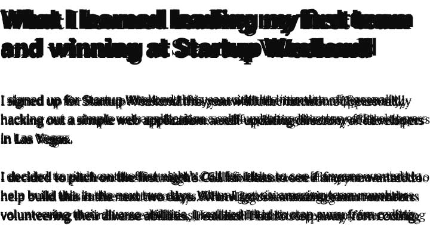
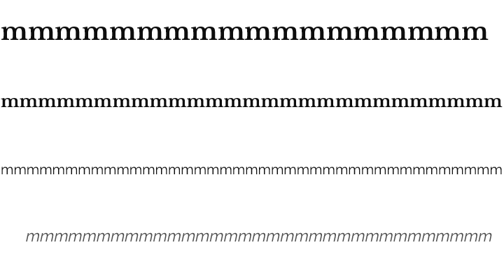
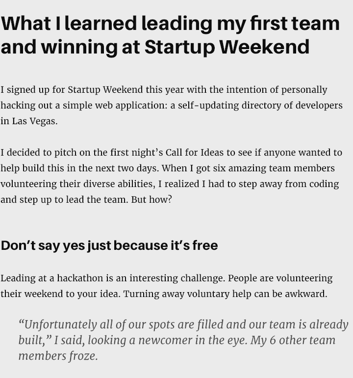
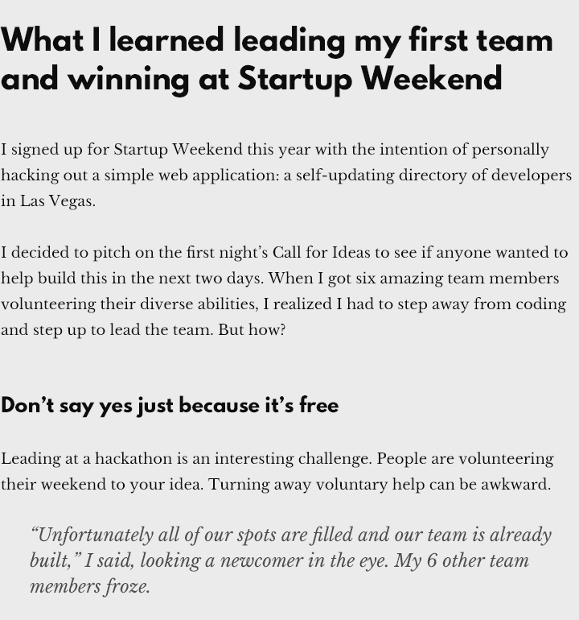
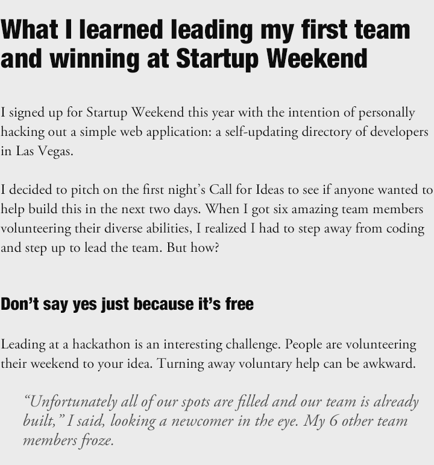
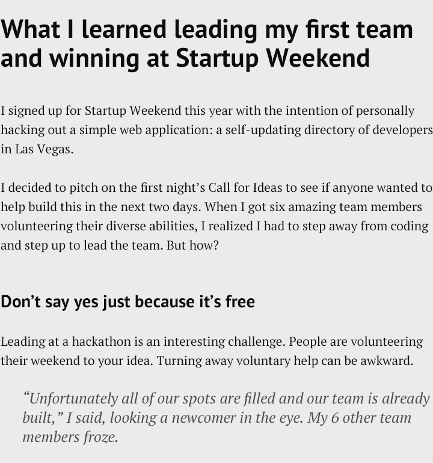
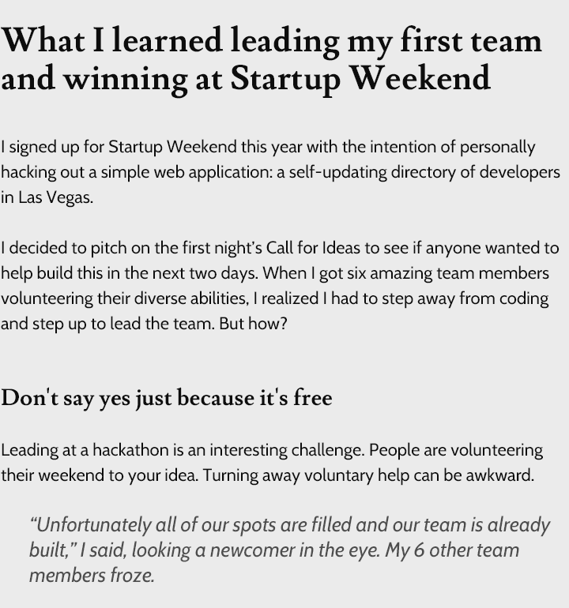
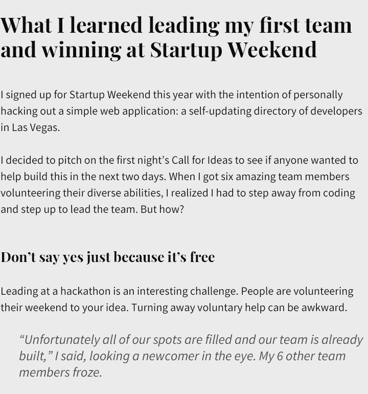
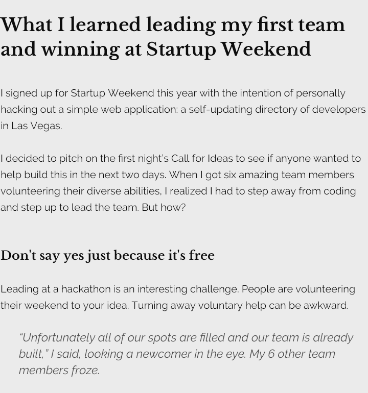

I had to decide what fonts to use in this blog. I created seven font pairings I liked, based on good UX principles.

The first principle is to optimize the amount of characters per line for readability. Depending on your source, this is between 50 and 80. But what's a character? I know of designers that use a random sampling of characters. But why not simply use the same character and measure your fonts on that?

For this blog:

* `<h1>` has 18 `m`s per line
* `<h2>` has 27 `m`s per line
* `
` has 39 `m`s per line
* `<blockquote>` has 33 `m`s per line

That's the letter `m` I'm talking about:

Fonts vary wildly in sizes. 12px of Cabin is not 12px of Playfair Display. Use `m`s per line to keep your fonts similarly sized.

I'm going to list seven font pairings I like with this method. In the following examples, I use 48px line-height for H1 and 32px line-height for everything else. I like less line-height for headings and more for paragraph text.

I'm using a snippet of text from [What I learned leading my first team and winning at Startup Weekend](/what-i-learned-leading-my-first-team-and-winning-at-startup-weekend/). (Real data is always better than Lorem Ispum.)

## Aileron - Merriweather

* **H1**: Aileron, Heavy, 40px
* **H2**: Aileron, Heavy, 27px
* **P**: Merriweather, Regular, 18px
* **Q**: Merriweather, Italic, 23px

## League Spartan - Libre Baskerville

* **H1**: League Spartan, Bold, 36px
* **H2**: League Spartan, Bold, 24px
* **P**: Libre Baskerville, Regular, 18px
* **Q**: Libre Baskerville, Italic, 22px

## Helvetica Neue - Adobe Garamond Pro

* **H1**: Helvetica Neue, 97 Black Condensed, 45px
* **H2**: Helvetica Neue, 97 Black Condensed, 29px
* **P**: Adobe Garamond Pro, Regular, 24px
* **Q**: Adobe Garamond Pro, Italic, 24px

## PT Sans - PT Serif

* **H1**: PT Sans, Bold, 44px
* **H2**: PT Sans, Bold, 29px
* **P**: PT Serif, Regular, 21px
* **Q**: PT Serif, Italic, 25px

## Lusitana - Cabin

* **H1**: Lusitana, Bold, 43px
* **H2**: Lusitana, Bold, 29px
* **P**: Cabin, Regular, 18px
* **Q**: Cabin, Italic, 22px

## Playfair Display - Source Sans Pro

* **H1**: Playfair Display, Bold, 41px
* **H2**: Playfair Display, Bold, 27px
* **P**: Source Sans Pro, Regular, 22px
* **Q**: Source Sans Pro, Italic, 26px

## Libre Baskerville - Raleway

* **H1**: Libre Baskerville, Bold, 35px
* **H2**: Libre Baskerville, Bold, 24px
* **P**: Raleway, Regular, 20px
* **Q**: Raleway, Italic, 23px
