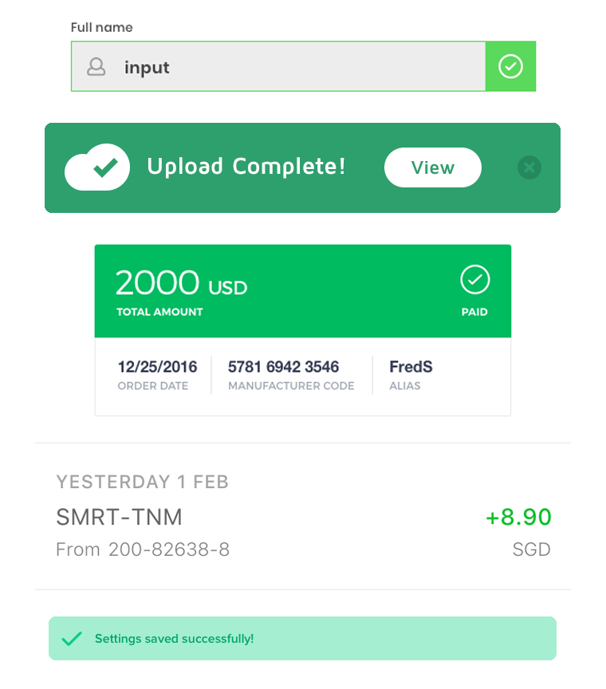
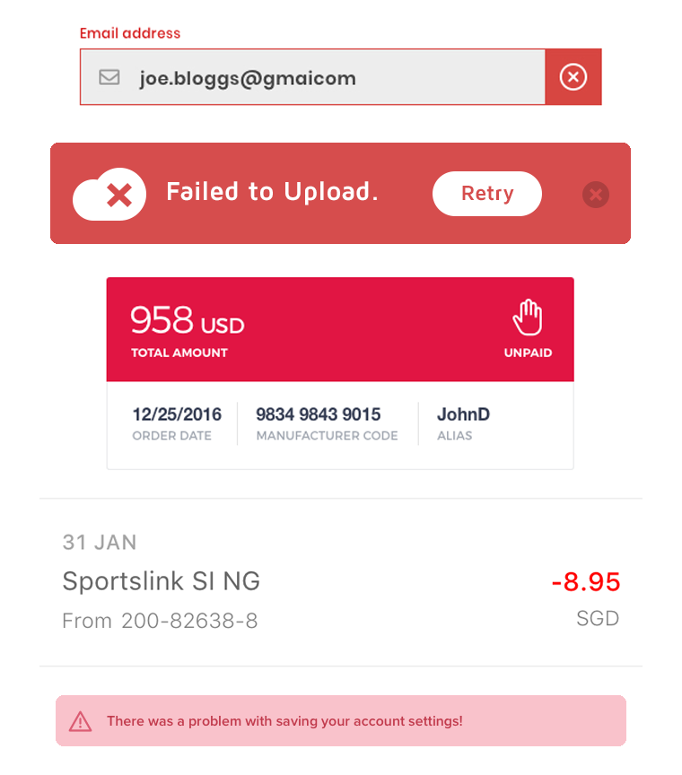

<figcaption>
Artwork by <a href="https://dribbble.com/shots/5621499-A-van-with-a-Christmas-tree" target="_blank">Camilla Frabetti</a>
</figcaption>

An "app" is [generally considered](https://en.wikipedia.org/wiki/Application_software) software designed for a user. This could be a mobile app, desktop app, or anything in between.

Now, this definition includes nearly every website as well. Most websites interact with users in some way—they have a contact form, a search bar, or an input box to sign up for a mailing list.

Virtually any time you accept user input in your app, you must also offer [validation](https://uxplanet.org/designing-more-efficient-forms-assistance-and-validation-f26a5241199d) of the user's input. This means you need at least two critical colors for your application: green and red.

##Green means $UCCE$$

In English-language applications, green typically has the following meanings:

- Correct
- Continue
- Success
- Positive

Here's some examples:

<figcaption>
From top to bottom, UI designs by <a href="https://dribbble.com/shots/4207164-Form-Validation" target="_blank">Joe Rutland</a>, <a href="https://dribbble.com/shots/2785416-Flash-Message-DailyUI-011" target="_blank">John Pascarella</a>, <a href="https://dribbble.com/shots/3175078-Simple-Status-Message" target="_blank">Hernan Vionnet</a>, <a href="https://dribbble.com/shots/2757257-Mobile-Banking" target="_blank">Bady</a>, and <a href="https://dribbble.com/shots/3717832-Daily-UI-011" target="_blank">Matīss Salimskis</a>.
</figcaption>

Since you don't suck at UX, your UI lets the user know when they've done something correctly. If this UI has color, it should most often be the color green.

##Red means ERROR

In English-language applications, red typically has the following meanings: 
 
 - Incorrect
 - Stop
 - Error
 - Negative
 
 Here's some examples:
 

<figcaption>
From top to bottom, UI designs by <a href="https://dribbble.com/shots/4207164-Form-Validation" target="_blank">Joe Rutland</a>, <a href="https://dribbble.com/shots/2785416-Flash-Message-DailyUI-011" target="_blank">John Pascarella</a>, <a href="https://dribbble.com/shots/3175078-Simple-Status-Message" target="_blank">Hernan Vionnet</a>, <a href="https://dribbble.com/shots/2757257-Mobile-Banking" target="_blank">Bady</a>, and <a href="https://dribbble.com/shots/3717832-Daily-UI-011" target="_blank">Matīss Salimskis</a>.
</figcaption>

 Again, since you're not a UX novice, you have big, explicit error messages when the user needs to take corrective action. Which means an "incorrect" or "error" UI—almost always styled with the color red. 
 
 ##What about a mustard yellow error message?
 
 No, don't try to get creative and use other colors in place of green and red.
 
[Jakob's Law of Internet User Experience](https://www.nngroup.com/articles/end-of-web-design/) states:

>Users spend most of their time on other sites. This means that users prefer your site to work the same way as all the other sites they already know. — [Jakob Nielsen](https://www.nngroup.com/articles/end-of-web-design/)

You should stick with convention. You can use a greenish-tint (like teal) or a reddish-tint (like red-orange or pink) if it's part of your color palette. But certainly don't show a red success message or green error message. And don't leave a user guessing how they're supposed to feel seeing a yellow or blue validation message.

Some apps don't use color to call attention to its status messages. That's acceptable as long as the UI stands out appropriately and the user feels like they understand the state of the application at all times.

Finally, for accessibility's sake, never use **only** color to signify meaning.

##How often should you give visual feedback?

All the time. Far more than you think is necessary.

>The key to successfully designing a validated entry control is to give users generous feedback, as close to real-time as possible, so they can catch an error immediately, understand why the input was an error, and know how to remedy it.—[About Face](https://www.amazon.com/dp/1118766571/ref=cm_sw_em_r_mt_dp_U_kRFrCbCVA5WYC) p. 616

>One of the reasons software is so hard to learn is that it so rarely gives positive feedback. People want to use their software correctly and effectively... They need to be rewarded, or at least acknowledged, when they succeed. They will feel better about themselves if they get approval, and that good feeling will be reflected on the product.—[About Face](https://www.amazon.com/dp/1118766571/ref=cm_sw_em_r_mt_dp_U_kRFrCbCVA5WYC) p. 646

One thing that makes video games so fun is their rich, immediate feedback when you've done something well.

And if you're a programmer, you know how important a clear, specific, and immediate error message is. (Think of an "undefined" error at runtime vs a highlighted typo in your IDE.)

There is an important caveat: not all UI feedback should be "blocking." Providing constant feedback doesn't mean you have to halt the application and force the user to click "Ok" at every interaction.

Instead, application designers should think of creative, immersive, non-blocking ways to show generous, helpful feedback.

And the magical Christmas colors are there to help.

For a tutorial on how to integrate green and red colors into your existing brand palette, see [How to design colors for your app with Adobe Illustrator—plus 3 free palettes](/adobe-illustrator-how-to-design-colors-for-your-app-with-adobe-illustrator-plus-3-free-palettes/).