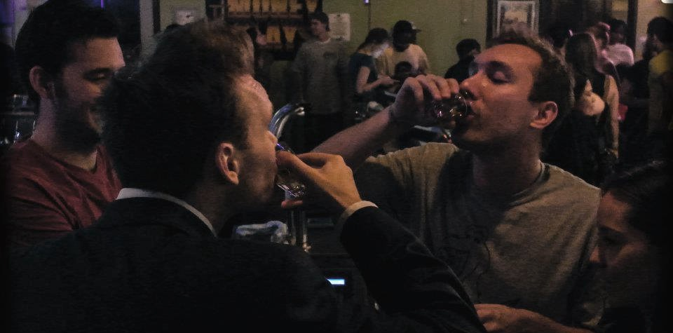

I had a weird life for a while.

I would wake up in the evening, go to a bar, set up an open mic, and then host a wild and popular event that would often revel into the early hours of the morning.

