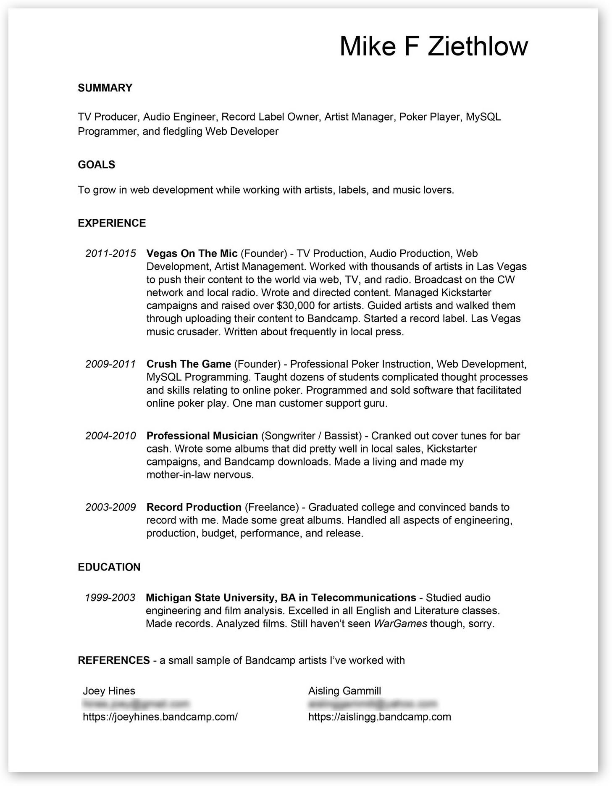
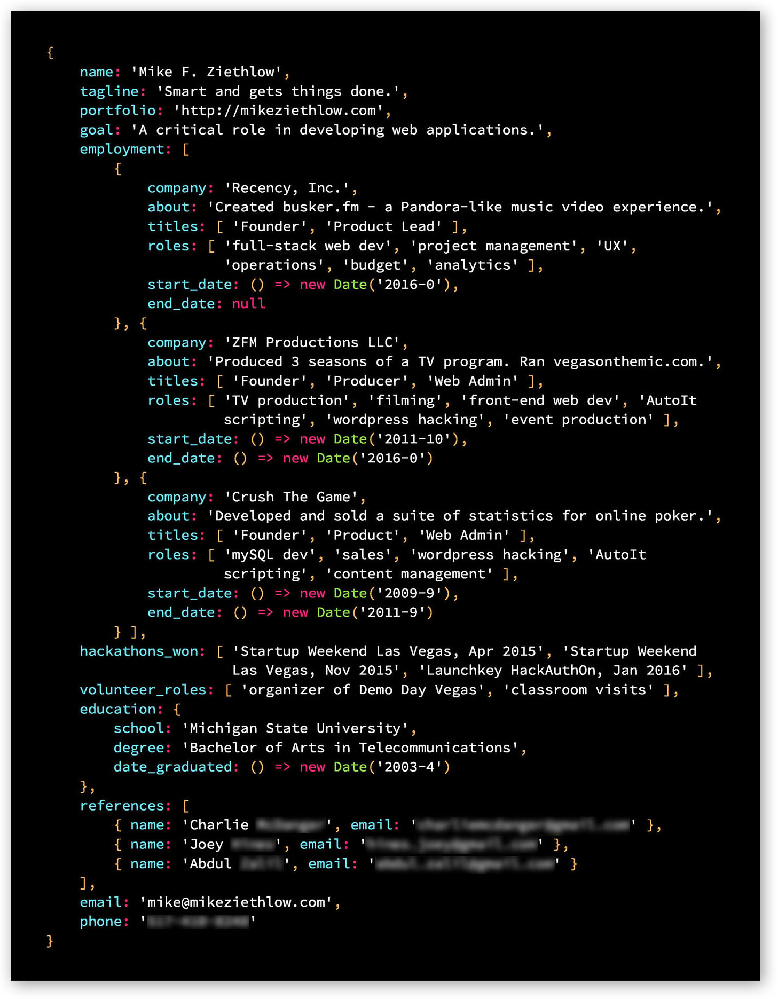
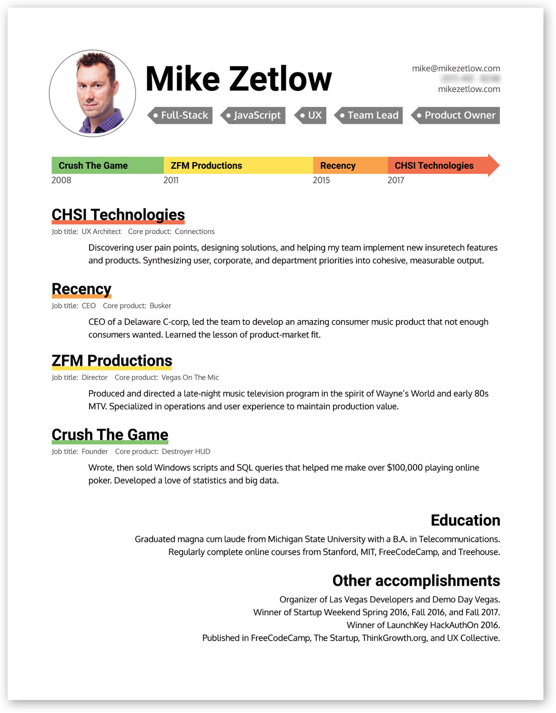

Resumes suck.

They suck to read. They suck to write. They suck as an indicator of a candidate's ability to perform the job they are applying for.

After a couple shitty entry-level jobs in college, I vowed to never write a resume again.

I was able to pull that off for more than a decade by working for myself.

But when I wanted to make a hard-left turn into the world of tech, I found myself staring my old foe, The Resume (also curriculum vitae or CV).

My first resume in over ten years was for a customer service position with [Bandcamp](https://bandcamp.com/), the independent online music store / social network. Applicants were expected to know basic web development skills to help artists debug problems with their online stores.

My resume looked like this hot garbage:

I emphasized my experience in working with artists. I showed a little personality. But really, I provided a bad user experience—what a bore to read and look at! What a failure of basic human psychology!

Humans have a "System 1" and "System 2" in their brains according to Nobel Prize winner Daniel Kahneman in [Thinking Fast and Slow](https://www.amazon.com/Thinking-Fast-Slow-Daniel-Kahneman/dp/0374533555). System 1 "thinks fast" and has an automatic, intuitive approach. System 2 "thinks slow" and is analytical, dominated by reason. Resumes, CVs, cover letters, and any other cold introduction of yourself are pure System 1.

That's not to say System 1 is an emotional, irrational response.

>System 1’s fast thinking is often logical and useful—“intuition is nothing more and nothing less than recognition.” ([The Big Think](https://bigthink.com/errors-we-live-by/kahnemans-mind-clarifying-biases))

It's simply the gut reaction gained from experience and pattern recognition. And it's the more powerful of the Systems.

>System 1 is more influential, guiding and steering System 2 to a very large extent.

If your resume is like mine above, ask yourself, would I want to look at or read this? I would wager most people have a subconscious aversion to looking at such a document (an intuition, à la System 1).

And if this is bad, what makes for good resume UX?

##The user

Good resume UX starts where all good user experiences start—with the user.

If you're applying to 12 different companies, you should have 12 different resumes, each tailored to job you are applying for. Does that sound like a lot of work? Suck it up, buttercup. Hiring is broken. You're not going to fix it. You can only play the game until you make enough money to get out of it.  

So tailor your resume to the position and the person reading it.

Figure out who is going to be looking at your resume. At least try to understand the _user persona_ of the person at the company who will be looking at it. My guess is they are probably busy, see a lot of resumes, and are going to rely on System 1 to sort the wheat from the chaff.

###What about job fairs?

It may seem impossible to consider a position or person when you're handing the same resume out to multiple companies at a career fair.

It's a less-than-ideal path to take on your job hunt, but you may find yourself at one. I actually got my current job at [CHSI Technologies](https://chsiconnections.com/) at a job fair!

At a job fair, I would say that standing out from the crowd and nailing System 1 are critical skills.

Here's the resume I used. There are some good and not-so-good UX practices found in it.

###Good practices

This resume was printed on glossy, heavyweight black paper. If you're a software developer, you get it. It's a JavaScript object in an IDE.

It's striking design accomplished two things for me:

It stood out. Out of 50 developers, I was the only one with a black resume. It was great UX: I imagined a hiring manager going through their pile of resumes after the fair and immediately being able to spot mine and recall me.

It was divisive. "I don't know what to do with this," said one of the managers at the job fair. That was great. I wanted to work for a technical manager, not a business person. The CTOs at the job fair understood it, and that's who I wanted to work with. 

###Not-so-good practices

Maybe I was being harsh in writing off all business managers or people not willing to try to understand the JavaScript object. (It's not that hard!) I could have made something more accessible and perhaps gained more interviews.

It's a bad visual representation of the data. It's literally just data!

It's not very readable. Even my IDE has more "whitespace."

Trying to gain a perspective of the timeline of my career is almost impossible. I'll give credit to my first resume above—with the dates listed in the left column, it was much easier to understand than this.

All in all, this resume helped me get 5 interviews, 2 offers, and 1 great job.

##Design for System 1

