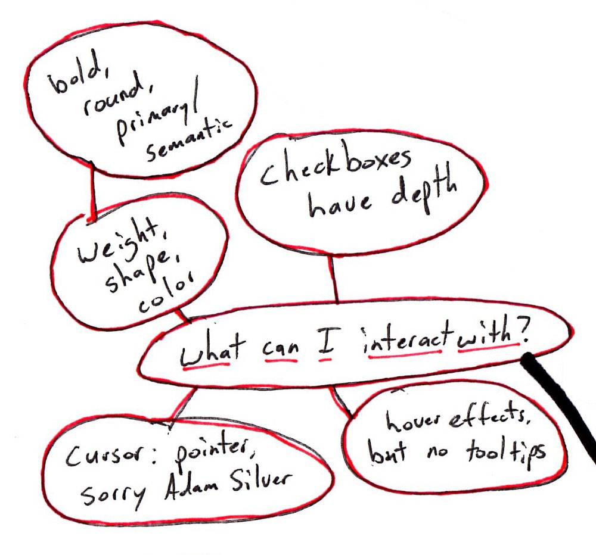

*Published in [CHSI Technologies](https://medium.com/chsi-technologies/theres-no-divine-inspiration-in-design-8a2fdd521d16).*

You might imagine the Designer being handed a product or application idea, retreating to their mountaintop meditation spot for days, then descending to the townsfolk and blessing the world with their divinely-inspired new design. The oohs and ahhs suggest genius. Questioning their methods would be heresy.

Some designers are like this. And they take critique of their work as a personal attack.

But a designer who designs successful products is nothing like this.

>Successful products meet user goals first. — [About Face (p. 80)](https://www.amazon.com/About-Face-Essentials-Interaction-Design/dp/1118766571/)

## Start with the user

There are lots of people who may have thoughts on how the product should be designed. But only one group of people is essential: users.

Non-essential input comes from all directions: buyers of the product (may not be the same as users), managers, internal politics, the technical team, even people’s mothers. They all have their own goals for the product.

>Although these goals do need to be addressed, they must not be addressed at the user’s expense. — [About Face (p. 79)](https://www.amazon.com/About-Face-Essentials-Interaction-Design/dp/1118766571/)

A design language not focused on user goals is just fancy gibberish. You can’t have good design without attending to what the user needs.

## Case study: CHSI Connections

As the User Experience Architect at CHSI Technologies, I am responsible for creating a new design language for our Connections application. So to start, I didn’t go up onto my mountaintop. I began by making phone calls to users.

Users of Connections want to manage their insurance policy administration, CRM, and reporting smoothly. The main tasks Connections users perform are data entry and the display of dense information. So the question for designers is, how can we best help them with that? (Note: it’s not which colors or buttons I like, or which software industry giant I want to mimic. My personal preferences don’t matter. I have no dog in this fight. I’m here for users, not to proselytize my taste.)

I interviewed and observed users and mapped out their needs.

## A design language built on user needs

Above is an actual mind map of my design process, so it’s pretty messy. After rounds of user phone calls, I came up with 5 core areas our users are asking for help with. Based on the 5 core areas and mapping outward from there, the design of the application was actually pretty straightforward.

### What can I interact with?

How can I tell what is clickable? What do I expect to happen when I click on X UI element? If I click on something, will what I expect to happen actually happen?

Key design rules:

1. No underlines on hyperlinks, instead use a heavy weight and color and hover effects — too many underlines affect readability.

2. Be consistent on what’s clickable. Nothing should surprise the user.

3. Checkbox and radio buttons have visual depth, everything else flat, with light shadowing on buttons.

4. Hover effects are strictly visual enhancement and not necessary to understand what’s clickable. And they are never used to display crucial information like a tooltip.

### Intuitive input fields

What can I type into and begin editing? How can we prevent the application from looking like a government form — rows upon rows of lifeless white input boxes?

Key design rules:

1. Borderless input boxes to avoid that “government forms” look.

2. Use 1 shade darker of the gray scale to make the input visible.

3. Be consistent — inputs in tables and header can be styled the same way.

4. A visual distinction between label and field with column sizing — 1/3 is the label, 2/3 is the field.

### Navigation

Where am I in the application? How do I get to where I was or where I want to go? How do I know what’s related to where I’m at?

Key design rules:

1. Distinct and original icons for the core pages in the application.

2. Visually highlight the present page.

3. A hierarchy of pages.

### Readability

How can this information best be presented to me? I can’t afford to make a mistake due to misreading something. Do I understand what every icon means?

Key design rules:

1. No gradient backgrounds with text; flat is the default.

2. Increase font size and use a legible font. (See the difference between the 1, I, l, and | characters.)

3. Strong contrast for primary text elements.

4. [Natural language syntax](https://www.flickr.com/photos/visualpunch/8656165342/in/photostream/) (see the difference in the login info in the upper right of the screenshots below).

5. Understandable icons, else use text.

6. Consistent, repetitive phrasing on elements that repeat.

### Unpack the density

I need a lot of information at my fingertips; can I get it without a headache? Can I quickly find what I need from the page I’m on?

Key design rules:

1. Ample padding.

2. No borders around tables or sections.

3. No boxes whatsoever. Keep the data “unbounded.”

4. For us, [table-striping](https://meta.discourse.org/t/the-death-of-the-grey-no-more-tiger-striping-rows-by-default/28664) is an anti-pattern, a hack to get around the fact that we’re displaying too much information. Much better to easily show relevant and hide irrelevant data. Thin lines can separate rows. Row highlighting on hover can also assist if the amount of information can’t be limited.

5. Use “outline” or “[ghost](https://uxplanet.org/ghost-buttons-in-ux-design-4cf3717334f8)” elliptical buttons to open up visual space.

## Connections “back in the ‘90s”

Connections is powerful web-based enterprise software, but “I feel like I’m back in the ‘90s when I’m on your site” — as one user put it. Below are the screenshots of what I call clientmain — the core of our CRM module — designed without addressing the above 5 areas of user needs.

## Connections in 2017

Below is what we get when we design clientmain based on the rules above that meet the user needs:

Not only is it “cleaner and modern” (in the words of that same user), but it is combining the functionality of 4 pages in “‘90s-era” Connections into one page that is “functionally more intuitive.”

### I’m not a design guru, just a guy willing to work the phones

After I observed users, clientmain practically designed itself.

If our customers are the happiest customers because of our well-designed product, and if it sells itself in demos, I know that CHSI Technologies is in a good place. We don’t have to go up on that mountaintop to look for inspiration. We just have to learn from users.