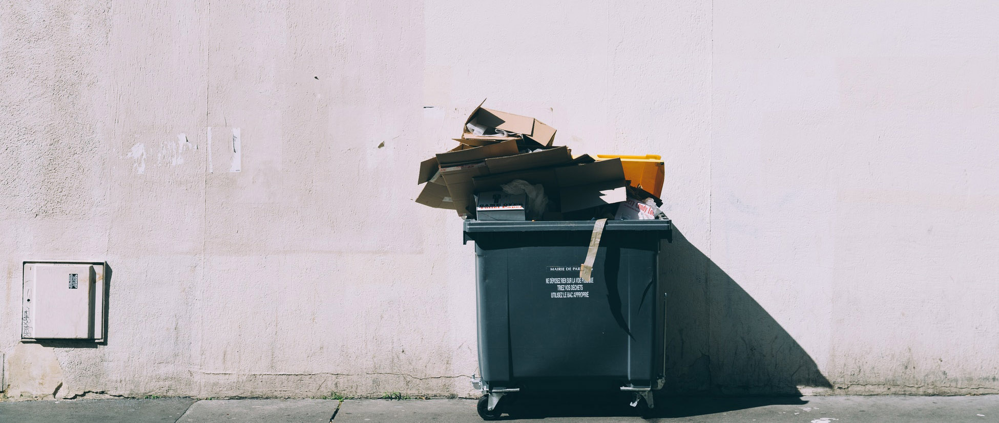

 
Willpower is the most important trait for getting things done and our long-term happiness.

Without it we don't tackle the difficult challenges we'd like to do—things that don't have an immediate payoff, but will cause our greatest joys down the road—like writing a novel, or building an app, or learning a language, or spending quality time with family. These things take a large investment of willpower to start, keep up, and complete.

Here's what drains our willpower and how to restore it.

##Willpower drains

Information itself depletes willpower because with every piece that comes in, you have to decide what to do with it. This is why checking your email, blogs, or social media first thing in the morning is a bad practice. You've immediately begun draining yourself before even starting on your tasks.

Which leads to the biggest drain on willpower: constant decision-making. This is why [Mark Zuckerberg wears the same thing every day](https://medium.com/startup-grind/choice-minimalism-why-mark-zuckerberg-wears-the-same-thing-every-day-2f132f1b5706)—“to make as few decisions as possible.”

Doubting yourself saps willpower. If you doubt your decisions, you are making them double or triple-times over and this can be draining. Be resolute and you will get more done. Be okay with making a wrong decision once.

Using "should" statements (also "I have to" or "I ought to") is draining:

>When you tell yourself how you “should”, “must”, or “ought” to feel and behave... you are constantly anxious and disappointed with yourself and/or with others around you.—[Thinking Traps](https://www.anxietybc.com/sites/default/files/ThinkingTraps.pdf)
 
Being constantly anxious or disappointed is a certainly a willpower drain! I view "should" statements as writing checks for future plans you'll never be able to cash. You don't need that mental baggage.

An unorganized workspace is just chock full of draining "should" statements — e.g. "I should clean this," "I should take care of this," etc. Better to throw it all in an archive folder or garbage bag and deal with it piece by piece in small chunks of time. "A cluttered desk produces a cluttered mind," as [the old adage](https://quoteinvestigator.com/2017/08/31/desk/) goes.

When you are sleepy you are depleted of willpower. This is why you get cranky and have less control when you stay up past your bedtime.

If you are hungry, you have less willpower. This is why it's better to not be totally starving before a meal; you need willpower to not pig out!

No matter what, even if your willpower wasn’t obviously depleted by anything particularly draining that day, the fact that it’s the end of the day will see your willpower waning. It's easier to turn on the TV at the end of the day than to write a chapter of your novel.

Being around negative people will also drain your energy and willpower. Block them out! (Literally use the Facebook "block" or "unfollow" features.)

<figcaption>

Cue "I'm meditating alone in my safe space, blocking out negative people" stock photo.

</figcaption>

It's not just negative people! If you have negative self-talk, you are in a constant battle, depleting yourself of energy to do the things you really want to do!

If you suppress any of your emotions, you are draining willpower from yourself. "Boys don't cry..." makes boys less productive.

Finally, social interactions that consume self-control (as opposed to friendly interactions that let you just "be yourself") drain willpower and energy. I'm sure your boss would like you to be more productive, but their awkward team-building events are probably draining you.

##How to restore willpower

The best way to keep your willpower up is to avoid willpower drains!

Reduce information coming in and the decisions you have to make. Reserve your willpower for the things that matter.

Another way to have more energy to execute tasks is to not rely on willpower at all. Make behaviors automatic by establishing good, consistent habits. I don't make a decision to brush my teeth before bed. I just do it because I've established that habit.

Motivations matter. If you have a strong enough "why" you can do anything. Like many people, I have a picture of my family on my desk. If I feel my willpower waning, I look at that.

<figcaption>

Okay, for this little guy, I'll sit through another meeting.

</figcaption>

Take time to plan what really matters to you in the long run. A [Passion Planner](https://passionplanner.com/) or [ClearerThinking.org](https://www.clearerthinking.org/) activity will help establish a strong "why."

Meditation can help replenish energy — but don't make it harder than it needs to be; just set a short timer and close your eyes and observe your thoughts and the sounds and senses around you. A few minutes is all you need.

Staring out the window and thinking of nothing—just observing the environment—for a few minutes is a form of meditation. Like I said, it doesn't have to be complicated!

To recharge, express emotions. Watch a short sad video. Or laugh at funny videos.

Make sure you get enough sleep. This is your body's way of naturally replenishing willpower and energy.

The end of a day is a willpower drain, but you can hack this. Do your most important work (the long-term goal stuff) earliest in the day.

Make sure you are satiated, not stuffed and not starving.

Take a break to do something you really want to do. Hard stop to leave you wanting to do more. Your brain is quicker to resume an activity if you've stopped in the middle of it.

I hate to sound like a hippie, but being in nature and exposing your senses to natural surroundings stimulates the human body—we get energized and restored.

"Being yourself" is a good replenisher of energy which leads to stronger willpower. Think of how good you feel after a genuine conversation with a close friend.

Ironically, exercising willpower can increase willpower. View yourself as a disciplined person.

[Performing rituals boosts our self-control through making us feel more self-disciplined](https://digest.bps.org.uk/2018/07/11/performing-meaningless-rituals-boosts-our-self-control-through-making-us-feel-more-self-disciplined/). So creating a ritual or routine for yourself that is meaningful or even entirely "devoid of meaning" will boost your willpower because it makes you feel like more of a disciplined person.

Finally, take a minute to quickly clean your workspace. Just throw it all in a bag or box and sort it out later!

<figcaption>

Or just throw it out.

</figcaption>