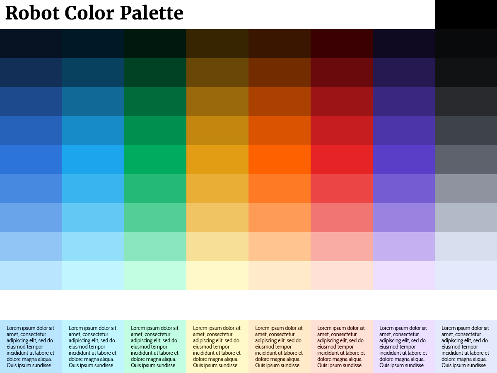
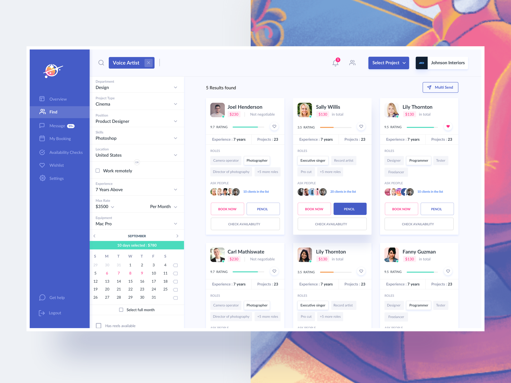

An "app" is [generally considered](https://en.wikipedia.org/wiki/Application_software) software designed for a user. This could be a mobile app, desktop app, or anything in between.

This definition includes nearly every website as well. Most websites interact with users in some way—they have a contact form, a search bar, or an input box to sign up for a mailing list.

Virtually any time you accept user input in your app, you must also offer [validation](https://uxplanet.org/designing-more-efficient-forms-assistance-and-validation-f26a5241199d) of the user's input. This means you need at least two critical colors for your application: green and red.

##Green means $UCCE$$

In English-language applications, green typically has the following meanings:

- Correct
- Continue
- Success
- Positive

--PIC: VALIDATION 

Since you don't suck at UX, you are letting the user know when they've inputted something correctly, styled with the color green.

##Red means ERROR

In English-language applications, red typically has the following meanings: 
 
 - Incorrect
 - Stop
 - Error
 - Negative
 
--PIC: VALIDATION 

 Again, since you're not a UX novice, you have big, explicit error messages when the user's input isn't valid. Which means an "incorrect" or "error" message, styled with the color red. 
 
 ##What about a mustard yellow error message?
 
 No, don't try to get creative and use other colors in place of green and red.
 
[Jakob's Law of Internet User Experience](https://www.nngroup.com/articles/end-of-web-design/) states:

>Users spend most of their time on other sites. This means that users prefer your site to work the same way as all the other sites they already know. — [Jakob Nielsen](https://www.nngroup.com/articles/end-of-web-design/)

You should stick with convention. You can use a greenish-tint (like teal) or a reddish-tint (like red-orange or pink) if it fits into your color scheme. But certainly don't show a red success message or green error message. And don't leave a user guessing how they're supposed to feel seeing a yellow or blue validation message.

##Brand colors

One of the first things an entrepreneur does when they start a business is design a logo. [It's a mistake.](http://dannorris.me/design-for-entrepreneurs/) But I get it.

Founders feel like their business is "real" once they have a logo. They may design it themselves, have a friend help them, or pay for something on 99designs or somewhere similar. (They probably don't hire a market research team and graphic design team.)

So the logo and branding is typically crap. And by the time they're able to hire an application designer, you are stuck working with the garbage colors picked out by the founder's earliest whims.

Not to worry. You can squeeze in suboptimal color choices and even expand the palette so the whole application looks cohesive.

##The 74 colors

You want white, black, and 9 shades of the following 7 hues:

- <strong style="color:#2196f3">Blue</strong>
- <strong style="color:#00BCD4">Teal</strong>
- <strong style="color:#4caf50">Green</strong>
- <strong style="color:#ffeb3b">Yellow</strong>
- <strong style="color:#ff5722">Orange</strong>
- <strong style="color:#f44336">Red</strong>
- <strong style="color:#9c27b0">Purple</strong>

Plus 9 shades of <strong style="color:#808080">Grey</strong>.

From a usability standpoint, I don't recommend more hues in between these, like indigo, violet, or pink. You can make your blue an indigo, your purple a violet, or your red a pink if that's what your branding calls for. The reason we are using the 7 hue categories above is because they are most easily distinguishable between each other. It's good UX.

(I'd prefer to simplify further and remove even orange from the above list, because, depending on the hue, users have trouble telling orange and red apart. But it's used as a "caution" or "warning" status in many applications and frameworks, so Jakob's Law applies and it stays.)

Blue is seen as the most benign color internationally, which is why it is used in many web apps.

And it's why offering two blueish hues (what I call Blue and Teal) is ok. Remember these are just blueish and teal-ish placeholders. They can be indigo and cyan or whatever works for your brand.

Here's what this looks like in practice. This is a color palette I made called Robot (click to see a high-quality version):

##Why do you need all these colors?

We've established that you need at least green and red. You need any other brand colors. And you may want an orange for a "caution" status or a yellow for an "info" status. Hyperlinks are most often blue if they're not a brand color.

You'll need the other hues if you're going to offer accent colors, labels, tags, chart lines, or any design where color plays a role.

###But why does each color need 9 shades?

Anything other than the most [brutalist](https://www.awwwards.com/brutalism-brutalist-websites.html) application will want differing shades of their hues.

In these app screenshots by Divan Raj at Greydesk Studio, he's using at least 4 different blue shades (not counting his teal shades):

<figcaption>
Courtesy <a href="https://dribbble.com/divanraj" target="_blank">Divan Raj</a> at <a href="http://greydeskstudio.com/" target="_blank">Greydesk Studio</a>
</figcaption>

Shades make the application look clean and professional. 😎

The designers at Medium [talk about how they use 4 shades of green](https://medium.design/green-4-2-0-64959f9381a7) in their application.

###How do you keep track of them?

I label each hue with a generic semantic name and then each shade a number 100 to 900, lightest to darkest. E.g. Blue 100 to Blue 900. This is how its done in [Material Design](https://material.io/design/color/#tools-for-picking-colors). The reason: headroom. You can later create a custom blue that is 40% between Blue 300 and Blue 400 and call it Blue 340. And then you can nitpick and make a color the tiniest perceptible shade darker from that and call it Blue 341. Headroom means you have room to add colors as needed.

One hundred degrees of separation between shades might be a bit overkill, but it's not confusing and serves its purpose. [IBM uses 10 degrees of separation](https://www.ibm.com/design/language/resources/color-library/) between shades—e.g. Blue 10 to Blue 90. That may be more sensible to you. Your choice. I use 100-900 in my examples.

###Examples of application elements

Your application has different elements that benefit from color shades. Here are some real-world examples from an app I designed, lightest to darkest.

- **100**—The background of an alert. Highlighting of text or a table row.

- **200**—A flat input, an input box with only a background color and no border. (This is a unique style I used in this app.)

- **300**—When highlighting or a table row is hovered over or activated.

- **500**—The background color of a button, tile, or icon.

- **600**—Colored text, e.g. hyperlinks or inline validation. Also used for the outline of [ghost buttons](https://uxplanet.org/ghost-buttons-in-ux-design-4cf3717334f8).

- **700**—The background color of a button, tile, or icon (500) when it is hovered over or activated.

- **800**—When colored text (600) is hovered over or activated.

- **900**—The text of an alert.

I didn't use 400 in this particular application. Just because you have all these shades (or hues) doesn't mean you have to use them. Some apps use as little as 3 shades if their design calls for it. Either way it's good to have them available in case the app needs them in the future—it's more headroom.

##Going from 0 to 74

There are 4 steps to create all these colors.

1. Find all the non-grey mid hues (500)
2. Find the lightest (100) and darkest (900) shades for each
3. Fill in the rest of the shades (200, 300, 400, 600, 700, 800)
4. Create the grey mid hue and its shades

###1. The non-grey mid hues

Start with any brand colors you may have.

The middle colors (shade 500) should be just dark enough to look good as a button with white text. Test this with the extremes, often yellow and teal.

--PIC: YELLOW BUTTON

If the brand uses colors that are lighter or darker, place them at 400 or 600 and make manual adjustments to find a 500-level shade that complements it.

If the brand utilizes a red or green hue, use that for the red or green in your palette.

Next, fill in the other hues at shade 500.

If you have a couple of the 7 hues you need in the 500 range, you can easily find colors that work with them. Even if you have only 1 color to start with, you can find complementary colors. (If you don't have any colors to start with, great! I offer some starting points below.)

I use these color-finding apps to fill in hues I'm missing:

[Colormind.io](http://colormind.io/)—This is my favorite. Enter in some colors and it will generate colors that match based on machine learning. If you "lock" colors in two positions with "unlocked" positions between them, it will try to find a match between those colors.

[PALX](https://palx.jxnblk.com/)—Have only one color? Enter it and PALX will generate a full palette with every shade. This one application does everything most developers would need if they were starting with 0 or 1 colors. (It's starting palette is pretty great.) From a UX perspective, they offer too many similar hues—e.g. Lime, Green, Teal—so I recommend only using colors that fit into the 7 hues I list. Also, their Grey has too many shades in the middle and not enough in the extremes.

[Mycolor.space](https://mycolor.space/)—This app does some magic behind-the-scenes but can be useful for finding complementary colors. Enter a color from your palette and it will give you some options.

[Chroma.js](http://gka.github.io/palettes/#colors=lightyellow,orange,deeppink,darkred|steps=7|bez=1|coL=1)—Want to find complementary colors between 2 colors? (Say, between yellow and red.) This will give you a perfect in-between color (or series of colors) without looking like mud.

[meyerweb Color Blender](https://meyerweb.com/eric/tools/color-blend/#:::hex)—This color blender isn't smart and will get you muddy hues if you're not careful. But it works well when you have two hues that mix well—like any primary color combination. So if you're missing Purple, Green, or Orange, this comes in handy.

[Session College Color Calculator](https://www.sessions.edu/color-calculator/)—Want some cold, hard math behind finding a complementary color? Here you can enter a color and view its analogous, triadic, and tetradic combinations.

[PallyPal](https://graysonhicks.github.io/pallypal/)—This tool requires some playing around to get desirable results. Input one color and adjust Scheme and Variation to see some possible colors that could complement your palette.

[Coolors.co](https://coolors.co/4e598c-ffffff-f9c784-fcaf58-ff8c42)—Press spacebar. See colors. Lock in the colors you like. Repeat. It's got a sense of magic to it and a dead-simple UX. The only downside is that you can only work with 5 colors at a time.

**What if you have no brand colors yet?**

You're in a great spot! You won't have to compromise with poor prior color choices. You can start with scientifically, artistically perfect palettes. I offer 7 free palettes further below.

You can also tap into professionally designed palettes to find some or all of your starting colors. I typically grab some 500-level shades from one of these sources, then use the above tools to fill in the hue or two I'm missing.

[Material Design](https://material.io/design/color/the-color-system.html#tools-for-picking-colors)—This is a seminal work on color in application design. However, the colors are "bunched up" in the mids—the 100 isn't light enough and the 900 isn't dark enough. So I find only the middle shades valuable. They have 17 hues, and I recommend sticking to the 7 placeholders I've described.

[IBM Design Color Library](https://www.ibm.com/design/language/resources/color-library/)—Another great resource. They also have too many hues; you'll have to decide which you like best. They have 3 very workable Blues and 3 workable Purples, for example.

[Project Clarity](https://vmware.github.io/clarity/documentation/v1.0/color)—This is a framework focused on UX. They have 11 distinct hues (compared to Material Design's 17) that are really excellent. However, while they have many excellent light shades, they have few dark shades.

[Tachyons](http://tachyons.io/)—An open-source component library, they have really solid mid colors. This is a great place to pull your shade 500 from.

[colors.css](http://clrs.cc/)—Another good component library. Its goal is to replace the crappy named HTML colors with colors that look nicer and work better together.

[plotly colorlover](https://plot.ly/ipython-notebooks/color-scales/)—You can look in some interesting places for colors that go well together. This Python library has standard and non-standard shades. If you want a sky Blue and a peach Orange, this offers some combinations.

[Microsoft Metro UI](https://solvit.io/2454237)—This is a very workable palette for finding 500-level shades. Too many hues again, but pick your favorites. Microsoft has a new design language called Fluent. [Its colors are hot garbage.](https://fluentcolors.com/) (No yellow? 11 shades of red/pink?) Metro was a lot simpler and clearer.

[Apple's iOS System Colors](https://solvit.io/7b49a27)—Apple provides the exact 7 hues I suggest for best usability, but they add an 8th, Pink. I recommend either selecting the Red or the Pink for your Red hue, not using both.

[duolingo's Style Guide](https://www.duolingo.com/design/#scroll-nav-1)—Don't rip off duolingo's style, but do look here for inspiration. Their goal was to create "vibrant, juicy colors," and I think they nailed it.

When you're all done picking your 500-level hues, you should have a nice middle band of colors. They should all feel like they belong together with the same brightness and saturation. (You don't want to mix neons, pastels, flats, or vibrants.) They have to look like they're part of the same family, yet you should be able to easily tell each color apart.

--PIC: MID COLORS ONLY, NO GREY

###2. The lightest and darkest shades

Next, you want to find the lightest (100) and darkest (900) shades for each 500-level hue. You can do this manually with Photoshop or another color or image editor, or use an online tool.

To find 900 manually, boost the saturation to 100%, then lower the brightness all the way until you can barely tell what the color is on a white background. It should be almost black, but on a close look, you are able to tell what hue it is.

To find 100 manually, boost the lightness (which is the amount of white) all the way until you can until you can barely tell what the color is on a white background. It should be as light as possible, but on a close look be visible as its color. If the lightness is at 100 and the color is still to dark, you can lower the saturation until you get it right.

If all that sounds too technical to you, try these tools:

[Chroma.js](http://gka.github.io/palettes/#colors=white,d21920,black|steps=11|bez=0|coL=0)—Not only is this good for finding complementary colors between other hues, you can set it up to find all the shades you need for your application as well. Enter `white, <your 500-level hue's hex code>, black` in the input box. Set the step count to 11. Leave "Bezier interpolation" and "Correct lightness gradient" unchecked. The steps between the white and black endpoints are your 100-900 shades!

[Shadowlord](https://noeldelgado.github.io/shadowlord/#D21920)—This hacker project by [Noel Delgado](https://github.com/noeldelgado) will give you 67 shades of any color. It places the color you give it in position 34 and creates light and dark shades above and below it. To use this for our purposes, use the shades found at positions 5, 12, 20, 27, 34, 41, 49, 56, and 63. That's 100-900, respectively.

[meyerweb Color Blender](https://meyerweb.com/eric/tools/color-blend/#:::hex)—This tool is for blending between two hues, but actually works best finding shades for your color palette. Enter #000 as your first hue and your 500-level hue as the second. Select 4 midpoints and click "Blend." Take all the colors except black. These are shades 900 to 500. ([Example](https://meyerweb.com/eric/tools/color-blend/#000000:D21920:4:hex)) Change #000 to #fff and "Blend" again. Take all the colors except white. You now have shades 100 to 500. ([Example](https://meyerweb.com/eric/tools/color-blend/#FFFFFF:D21920:4:hex))

[Coolors.co](https://coolors.co/4e598c-ffffff-f9c784-fcaf58-ff8c42)—Input up to 5 of your colors, then click the icon that means "Toggle alternative shades." You'll see 21 shades for your colors. This is a little much. I recommend taking shades 2, 5, 7, 9, 11, 13, 15, 17, 20 for your 9 shades. You'll have to repeat this process one more time, since you can only do up to 5 colors at a time. ([Example](https://coolors.co/d21920-f16421-ffbe39-07a04e-20409a))

[Colorlib Color Mixer](https://colorlib.com/etc/color-mixer/)—This tool asks for 2 colors and then gives you 17 values between the two endpoints (19 total). Enter your 500-level hue at the top and #000 at the bottom. Then take shades 5, 9, 13, and 17 for your 600, 700, 800, and 900 respectively. Replace #000 with #fff. Take shades 5, 9, 13, and 17 for 400, 300, 200, and 100 respectively.

[PALX](https://palx.jxnblk.com/)—This app also offers shades for the palettes it creates for you. Their shades 1 to 9 line up well with the shades you need: 100 to 900. (Ignoring their shade 0.) It's not pixel-perfect, however. Your 500-level hue is their 5-level hue, but they alter it by a small degree. For example, [they change my Orange #f16421 to #f16321](https://palx.jxnblk.com/f16421).

These mixing tools offer the same functionality, but are using different algorithms. It's your choice which looks best to you.

--GREYS

https://en.wikipedia.org/wiki/Middle_gray

--FREE HALF-HOUR TUTORIAL VIDEO
